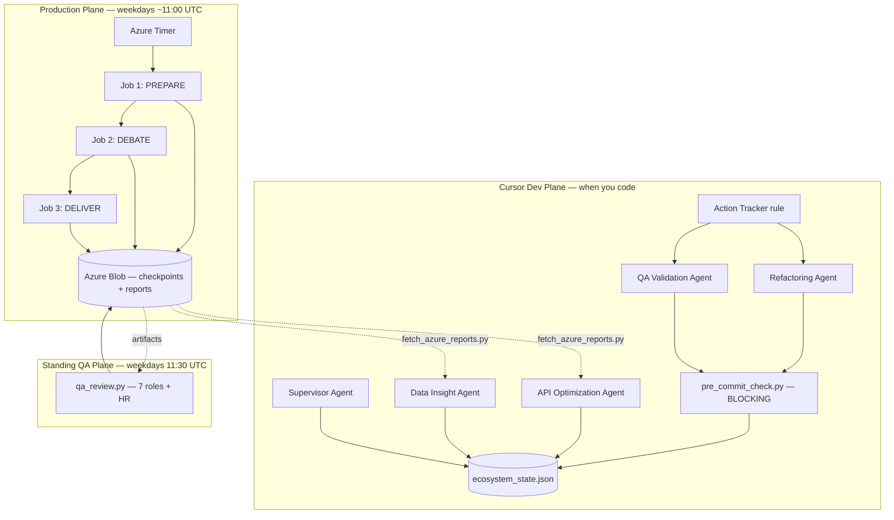
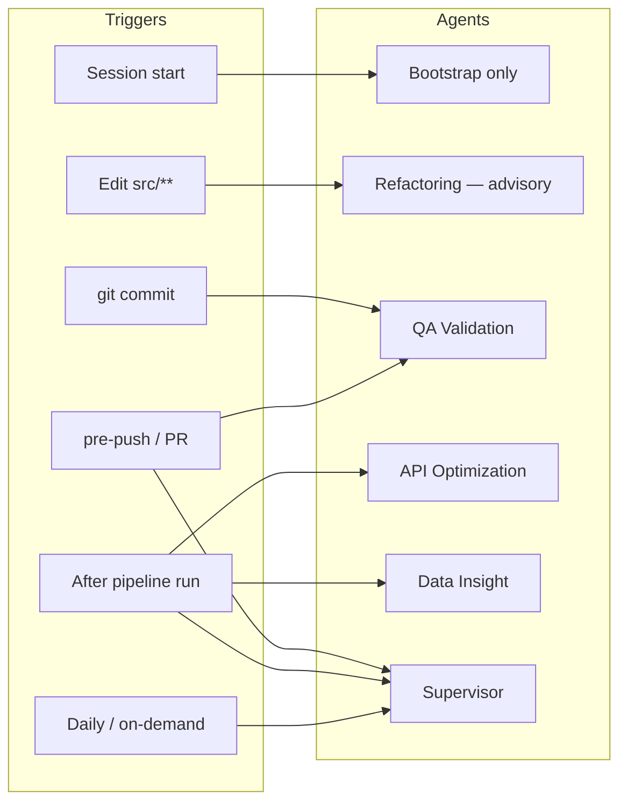
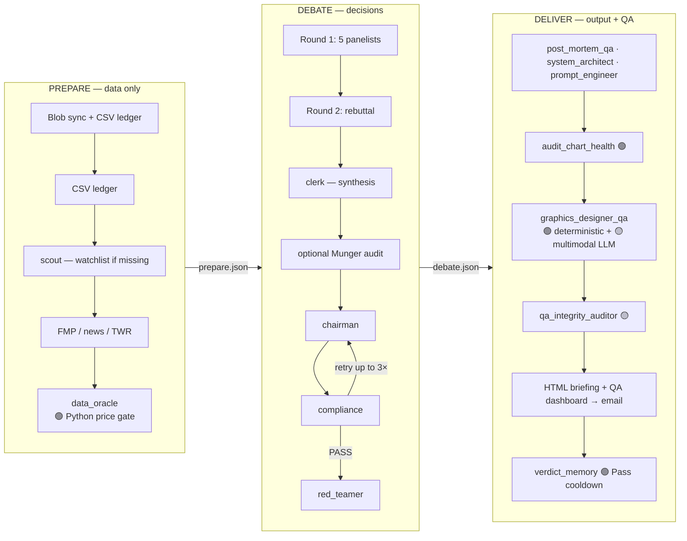
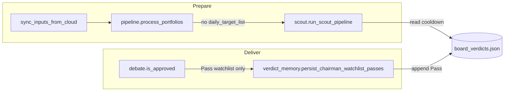
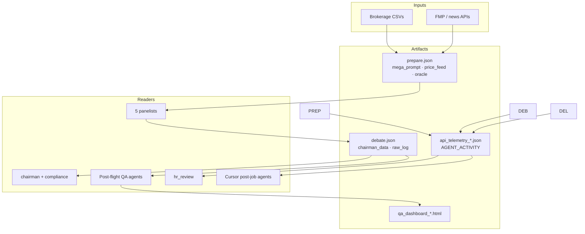
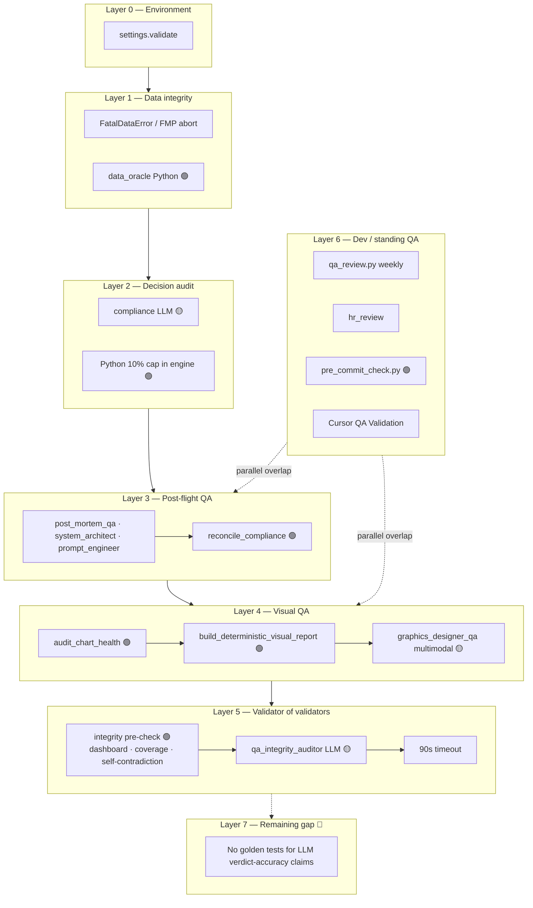

# SC Invest Boardroom — Agent Architecture

**Status:** Active  
**Last updated:** May 29, 2026  
**Owner:** Stan  
**SSOT for:** agent inventory, interaction diagrams, QA validation layers, and when to update this doc  

**Related docs**

| Doc | Purpose |
|-----|---------|
| [`.cursorrules`](../.cursorrules) | Guardrails, Cursor sub-agents, triggers, failsafes |
| [`technical_solution.md`](technical_solution.md) | End-to-end system design, data layer, deploy |
| [`engineering_playbook.md`](engineering_playbook.md) | Rejected approaches — read before retrying |
| [`action_tracker.md`](action_tracker.md) | Backlog and Session Handoff |

---

## Keeping this document current

Update **`docs/agent_architecture.md`** whenever you change any of the following:

| Change | What to update here |
|--------|---------------------|
| Add/remove/rename agent in `src/core/agents.py` | §3 runtime roster, §5 agent counts |
| Add/remove Cursor rule in `.cursor/rules/` | §2 Cursor plane, §4 trigger table |
| New pipeline phase or job split | §3 production flow diagram |
| QA agent or validation layer change | §6 QA stack, §7–§8 golden fixtures |
| Agent promoted 🟡 → 🟢 (code-enforced) | §8 enforcement legend + roster notes |
| Cross-run state / scout cooldown change | §3.6 verdict memory |

**Do not duplicate** guardrail prose here — edit `.cursorrules` only.  
**Do not duplicate** FMP/API details — see `fmp_data_dictionary.md`.

After updating, bump **Last updated** at the top of this file.

---

## 1. Three execution planes

The repo runs **three agent ecosystems** that share Azure artifacts and docs but fire at different times.



| Plane | Entry point | Typical LLM calls |
|-------|-------------|-------------------|
| Production | `function_app.py` timer → `prepare` → `debate` → `deliver` | ~17–26 / weekday run |
| Cursor dev | `.cursor/rules/*.mdc` + git hooks | On commit / post-job / daily |
| Standing QA | `qa_review_daily_run` timer | +8 / weekday (separate from pipeline) |

---

## 2. Cursor dev agents

Configured in `.cursor/rules/` and orchestrated per `.cursorrules` §4–§5.



| Agent | File | When | Blocking? |
|-------|------|------|-----------|
| **Action Tracker** | `action_tracker.mdc` | Every session | Read-only context |
| **Refactoring** | `refactoring_agent.mdc` | Edits to `src/**`; pre-commit | Hook blocks |
| **QA Validation** | `qa_validation_agent.mdc` | Pre-commit; pre-push | Hook blocks |
| **API Optimization** | `api_optimization_agent.mdc` | Post-job only | Advisory |
| **Data Insight** | `data_insight_agent.mdc` | Post-job only | Advisory |
| **Supervisor** | `supervisor_agent.mdc` | pre_push, post_job, daily | Synthesis |

**Task vehicles** (not personas): `explore`, `shell`, `generalPurpose`, `ci-investigator`.

**Communication:** append-only `ecosystem_state.json` + human docs (`action_tracker.md`). Agents do not message each other directly.

---

## 3. Production pipeline — runtime agents

Registry: `src/core/agents.py` → `agent_config["board_members"]`.



### 3.1 Panelists (debate core)

| Key | Persona | Model | Thinking budget |
|-----|---------|-------|-----------------|
| `buffett` | Warren Buffett | Pro | 4096 |
| `lynch` | Peter Lynch | Pro | 4096 |
| `livermore` | Jesse Livermore | Pro | 4096 |
| `huang` | Jensen Huang | Pro | 4096 |
| `simons` | Jim Simons | Pro | 4096 |

### 3.2 Decision & audit (debate)

| Key | Persona | Model | Role |
|-----|---------|-------|------|
| `clerk` | Ray Dalio | Flash | Debate synthesis |
| `chairman` | Stanley Druckenmiller | Pro (8192 think) | Final allocation |
| `compliance` | Harry Markopolos | Flash | Chairman vs board audit (retry loop) |
| `red_teamer` | Adversarial Red Teamer | Pro | Bear case for briefing (non-feedback) |
| `data_oracle` | Pre-Flight Data Oracle | — | **🟢 Python only** — `src/core/data_oracle.py`; runs once in prepare |

**Munger audit** (conditional): reuses `buffett`, `huang`, `lynch` when concentration triggers — not a separate config key.

### 3.3 Post-flight QA (deliver)

| Key | Persona | Model | Validates |
|-----|---------|-------|-----------|
| `post_mortem_qa` | Post Mortem QA Auditor | Pro | Procedure vs debate log |
| `system_architect` | Systems Architect QA | Flash | Pipeline / JSON patterns |
| `prompt_engineer` | Prompt Engineer QA | Pro | Persona drift / sycophancy |
| `graphics_designer_qa` | Graphics Designer Visual SME | Flash | Final HTML + chart images |
| `qa_integrity_auditor` | QA Integrity Auditor | Pro/Flash | QA-of-the-QA |

### 3.4 Weekly standing QA (`src/qa_review.py`)

Runs **30 min after** the daily pipeline (11:30 UTC weekdays). **7 LLM roles + HR:**

| Key | Role |
|-----|------|
| `data_flow` | Data Flow Analyst |
| `prompt_engineering` | Prompt Engineer |
| `api_health` | API Health Monitor |
| `tech_stack` | Tech Stack Architect |
| `finance_cost` | Finance & Cost Consultant |
| `opportunity_audit` | Opportunity Auditor |
| `graphics_designer` | Graphics Designer (weekly critique) |
| *(injected)* | HR Efficiency — `src/hr_review.py` |

### 3.5 On-demand consultants

| Module | Purpose |
|--------|---------|
| `src/hr_review.py` | KEEP / MERGE / CUT roster analysis from `AGENT_ACTIVITY` |
| `src/finance_oversight.py` | Subscription / plan-fit audit |

### 3.6 Cross-run state — verdict memory & scout

Watchlist targeting uses **persistent JSON** synced through Azure `boardroom-state`, not in-repo generated markdown.



| Module | Role |
|--------|------|
| `src/verdict_memory.py` | Load/append/save `board_verdicts.json` — **Pass** entries only, gated on compliance-approved debate |
| `src/scout.py` | Builds `daily_target_list.json` from trending tickers minus **owned** (CSV ledger) and **Pass cooldown** |
| `src/jobs/prepare.py` | CSV parse **before** scout; passes `owned_tickers=master_ledger.keys()` |
| `src/jobs/deliver.py` | Calls verdict memory at end of successful deliver |

**Removed (May 2026 refactor cleanup):** `storage_client.save_memory()`, `pipeline.save_verdict_history()`, scout's dead `ledger_state.json` read.

**Repo hygiene (AI context):** run artifacts (`src/output/*.md`, `logs/`, `qa_*_latest.*`) are gitignored — see `.gitignore` and commit `3eda93d`.

---

## 4. Data flow — how agents interact

Agents do **not** call each other. State flows through **checkpoints and artifacts**:



| Artifact | Written by | Read by |
|----------|------------|---------|
| `runs/{id}/prepare.json` | prepare | debate |
| `runs/{id}/debate.json` | debate | deliver |
| `api_telemetry_{id}_*.json` | each phase | HR, API Optimization, weekly QA |
| `qa_dashboard_{id}.html` | deliver | email, integrity auditor |

---

## 5. Agent counts (quick reference)

| Category | Count | Notes |
|----------|------:|-------|
| Cursor maintenance agents | 5 | + Supervisor; Action Tracker is a rule not an agent |
| Runtime `board_members` keys | 15 | Includes retired-LLM `data_oracle` entry for HR/docs |
| Weekly QA digest roles | 7 + HR | Overlaps post-flight QA — consolidation backlog |
| On-demand consultants | 2 | HR + finance oversight |
| **Distinct personas (all layers)** | **~29** | Intentional overlap across layers |

**Typical Gemini calls per weekday production run:** ~17–26 (debate-heavy).  
**Oracle gate:** 0 LLM calls (deterministic since May 29, 2026).

---

## 6. QA & validation stack

Including **who validates the validators**:



### Enforcement legend

| Tag | Meaning | Examples |
|-----|---------|----------|
| 🟢 | Deterministic Python — authoritative | `data_oracle`, `reconcile_compliance`, `audit_chart_health`, `src/qa/visual_audit.py` |
| 🟡 | LLM advisory — useful, not sole authority | panelists, post-flight trio, graphics multimodal, integrity auditor |
| 🔴 | Known gap | tie-break prompt-only; no golden tests for integrity auditor |

### Key deterministic guardrails

| Function | Module | Effect |
|----------|--------|--------|
| `validate_price_feed()` | `src/core/data_oracle.py` | Abort on $0 price |
| `apply_chairman_guardrails()` | `src/core/guardrails.py` | Max 3 buys, 10% liquidation cap, 30-day wash-sale |
| `build_state_of_union_quotes()` | `src/core/state_of_union.py` | SoTU from panel `overall_portfolio_critique`, not per-ticker quotes |
| `reconcile_compliance()` | `src/qa_pipeline.py` | CRITICAL finding → force `is_compliant=false` |
| `audit_chart_health()` | `src/output/reporting.py` | HTTP probe each chart URL |
| `audit_briefing_html()` | `src/qa/visual_audit.py` | Email-unsafe CSS, missing alt, empty chart src |
| `build_deterministic_visual_report()` | `src/qa/visual_audit.py` | Merges chart + HTML checks before optional LLM |
| `build_deterministic_integrity_report()` | `src/qa/integrity_audit.py` | Dashboard fidelity, QA coverage, self-contradiction |
| `build_qa_scorecard()` | `src/qa/scorecard.py` | Per-agent findings + tokens; → `QA_SCORECARD` telemetry |

### QA agent scorecard

After each deliver run, `build_qa_scorecard()` records per QA agent:

| Field | Purpose |
|-------|---------|
| `is_compliant` | PASS/FAIL from that agent's report |
| `critical_findings` / `warning_findings` | Finding counts for tuning |
| `invocations` / `total_tokens` / `est_cost_usd` | Utilization from `AGENT_ACTIVITY` |
| `human_confirmed` / `human_notes` | Set manually when validating true/false positives |

**Stored in:** `api_telemetry_{run_id}.json` → `QA_SCORECARD` and `ecosystem_state.json` → `qa_scorecards[]`.

**Review:** `.venv\Scripts\python.exe tools\ecosystem_state.py show qa_scorecards --last 5`

### Human-confirmed QA review (Azure UI)

After the QA dashboard email, open the **Review QA accuracy** link (requires `QA_REVIEW_BASE_URL` + `QA_REVIEW_TOKEN` on the Function App).

| Setting | Example (production) |
|---------|----------------------|
| `QA_REVIEW_BASE_URL` | `https://app-boardroom-prod-b5h4epg2d0cxefa0.eastus-01.azurewebsites.net` |
| `QA_REVIEW_TOKEN` | Long random secret (App settings + local `.env` only) |

| Storage | Path |
|---------|------|
| Per-run | `boardroom-state` / `qa_human_review_{run_id}.json` |
| Rolling ledger | `boardroom-state` / `qa_human_reviews_ledger.json` |
| Local Cursor | `ecosystem_state.json` → `qa_human_reviews[]` (when writable) |
| Reports | `qa_reports_{run_id}.json` (full findings for the form) |

**Endpoint:** `GET/POST /api/qa-review?run_id=…&token=…` — deployed as `qa_human_review` (commit `e39b337`).

**Fetch for offline review:** `tools/fetch_azure_reports.py` pulls `qa_human_review_*` and `qa_reports_*`.

---

## 7. Visual QA golden fixtures

Regression tests for deterministic Visual QA — **add a fixture when you find a new visual defect in production.**

```
tests/fixtures/visual_qa/
  manifest.json              ← register new cases here
  good_briefing.html         ← passing baseline
  broken_flex_layout.html    ← email-unsafe flex
  missing_chart.html         ← empty img src
  missing_alt.html           ← accessibility
  *.chart_health.json        ← chart probe results (mocked ok/broken)
  *.expected.json            ← expected is_compliant + required findings
```

**Run:** `.venv\Scripts\python.exe -m unittest tests.test_visual_qa_fixtures -v`

**Workflow when a visual bug ships:**

1. Save the failing briefing HTML (or minimal repro) into `tests/fixtures/visual_qa/`.
2. Add `*.expected.json` with required CRITICAL findings.
3. Register in `manifest.json`.
4. If the bug class is new, add a rule to `src/qa/visual_audit.py`.
5. Update §6 diagram if a new validation layer was added.

---

## 8. Integrity QA golden fixtures

Regression tests for deterministic integrity pre-checks — **add a fixture when a QA dashboard bug ships.**

```
tests/fixtures/integrity_qa/
  manifest.json
  good_alignment.qa_reports.json       ← dashboard matches JSON
  dashboard_mismatch.qa_reports.json   ← PASS badge vs FAIL report
  dashboard_mismatch.dashboard.html
  self_contradictory_qa.qa_reports.json
  missing_qa_agent.qa_reports.json
  *.expected.json
```

**Run:** `.venv\Scripts\python.exe -m unittest tests.test_integrity_qa_fixtures -v`

**Workflow when a QA fidelity bug ships:**

1. Save the failing `qa_reports` JSON + dashboard HTML (or minimal repro).
2. Add `*.expected.json` with required CRITICAL findings.
3. Register in `manifest.json`.
4. If the bug class is new, add a rule to `src/qa/integrity_audit.py`.
5. Update §9 change log.

---

## 9. Overlap & consolidation backlog

Areas with **multiple owners** — track reductions in `action_tracker.md`:

| Concern | Overlapping agents | Target state |
|---------|-------------------|--------------|
| API / cost | API Optimization, weekly `api_health`, `finance_cost`, `finance_oversight` | One routine path + on-demand |
| Prompt drift | Data Insight, weekly `prompt_engineering`, `prompt_engineer` | Single review cadence |
| Graphics | Per-run `graphics_designer_qa`, weekly `graphics_designer` | Golden fixtures + per-run only |
| Architecture | Refactoring, pre-commit, weekly `tech_stack`, planned Architecture Validator | **Do not add** Architecture Validator |
| QA correctness | Cursor QA, post-flight trio, integrity auditor, weekly 7 | Scorecard + golden fixtures |

---

## 10. Change log (architecture-relevant)

| Date | Change |
|------|--------|
| May 29, 2026 | Deploy `e39b337`: `qa_human_review` live on Azure; collaboration protocol §0.5 in `.cursorrules` |
| May 29, 2026 | Human-confirmed QA review UI — Azure `/api/qa-review` + dual blob/state storage |
| May 29, 2026 | QA agent scorecard → `QA_SCORECARD` telemetry + `qa_scorecards[]` in ecosystem state |
| May 29, 2026 | `data_oracle` → deterministic Python; debate skips duplicate run |
| May 29, 2026 | Visual QA golden fixtures + `src/qa/visual_audit.py` |
| May 29, 2026 | This document created as agent-diagram SSOT |
