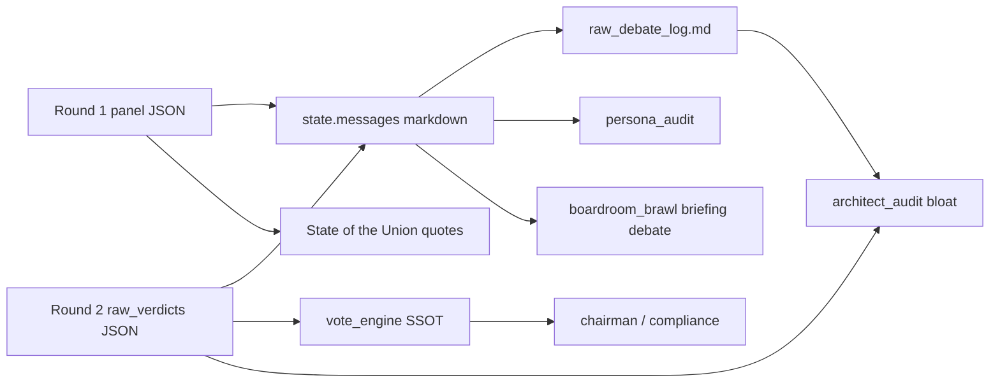

# Debate Quality & Systems Architect Handoff

**Status:** Deployed to prod — first validation run **`20260531_090637`** (partial green)  
**Last updated:** May 31, 2026 (post-deploy validation)  
**Owner:** Stan  
**Audience:** Systems Architect QA agent, Prompt Engineer QA agent, and supervising agents reviewing debate pipeline / post-flight QA.

**Related:** [`action_tracker.md`](action_tracker.md) · [`agent_architecture.md`](agent_architecture.md) §6 · [`qa_layers.md`](qa_layers.md) · [`hr_qa_roster_handoff.md`](hr_qa_roster_handoff.md) · [`product_principles.md`](product_principles.md)

---

## 1. Why this doc exists

May 31, 2026 working session with Stan: triaged three **P1** items from prod run **`20260531_014121`** that were failing **Prompt Engineer QA** and **Systems Architect QA**. Shipped in commits **`29052fa`** → **`4d0bbaa`** → **`c66e52e`**; first prod validation run **`20260531_090637`** on HEAD **`c66e52e`**.

Stan’s working rules for this effort:

| Rule | Implication |
|------|-------------|
| **Analysis first** on tracker items; implement after agreement | Do not silently expand scope |
| **No LLM retries** to mask bad process | Fix prompts or Python at source; let QA FAIL loudly if still broken |
| **Deterministic QA + unit tests** = done for code; prod run = validation | Mark tracker items `done` pending prod |
| **Options with recommendation** when tradeoffs exist | Architect should propose, not guess |

---

## 2. Prod baseline (before this session)

Run **`20260531_014121`** (~4.5 min SUCCESS) on prod HEAD **`b6984fa`**.

| QA agent | Failure | Tracker ID |
|----------|---------|------------|
| Prompt Engineer | 3× CRITICAL persona drift — forbidden cross-persona vocab in Round 2 | **PE-PERSONA-1** |
| Prompt Engineer | Round 2 `overall_portfolio_critique` verbatim copy of Round 1 | **R2-1** |
| Systems Architect | Debate log bloat — 192 `\bPass\b` mentions / 27 symbols; 86/100 watchlist Pass rows | **PASS-SPAM-1** |

Evidence: `qa_reports_20260531_014121.json` (fetch via `tools/fetch_azure_reports.py --run-id 20260531_014121 --post-job`).

---

## 3. What shipped (local WIP)

### 3.1 PE-PERSONA-1 — Round 2 persona drift (agent / prompt)

**Problem:** Panelists rebutting peers adopted the peer’s jargon (`margin of safety`, `relative strength`, `the tape`), triggering deterministic CRITICAL in `src/qa/persona_audit.py`.

**Root cause:** Round 2 prompt required citing peer Round 1 claims without requiring vocabulary translation.

**Fix:** `[ANTI-DRIFT PROTOCOL]` block in `build_round2_user_prompt()` (`src/core/rebuttal.py`).

**Not changed:** `FORBIDDEN_PHRASES` map or audit thresholds — detection stays strict.

**Tests:** `tests/test_persona_audit.py`, `tests/test_rebuttal.py`

---

### 3.2 R2-1 — Round 2 overview verbatim copy of Round 1 (agent / prompt)

**Problem:** `overall_portfolio_critique` in Round 2 duplicated Round 1 Portfolio Overview → `VERBATIM R1 COPY` CRITICAL (`is_verbatim_r1_copy`, ≥82% word overlap).

**Fix (prompt only, no retry):** Round 2 task item 1 in `build_round2_user_prompt()` now requires:

- **First sentence** must name another panelist and respond to their Round 1 claim.
- **≥50% new wording** vs the Round 1 block shown above.

**Not changed:** SoTU still uses Round 1 critiques (`src/core/state_of_union.py`) — briefing unaffected.

**Rejected approach:** Python retry loop in `execute_rebuttal_round()` — Stan explicitly declined (retries mask bad process).

**Tests:** `tests/test_rebuttal.py`, `tests/test_persona_audit.py` (`test_verbatim_r1_copy_detected_in_persona_audit`)

---

### 3.3 PASS-SPAM-1 — Watchlist Pass log bloat (code)

**Problem:** Two Systems Architect deterministic checks failed:

| Check | Module | Signal |
|-------|--------|--------|
| `audit_debate_log_bloat` | `architect_audit.py` | 192 `\bPass\b` in raw markdown log |
| `audit_watchlist_pass_spam` | `architect_audit.py` | 86/100 watchlist rows Pass in `raw_verdicts` |

**Root cause:** `engine.py` emitted one markdown line per watchlist Pass × 5 panelists × 2 rounds. High Pass **rate** on a large watchlist is **expected**; the bloat was **representation**, not bad votes.

**Fix (A + B + C):**

| Layer | Change |
|-------|--------|
| **A — Slim markdown** | `engine.py` uses `format_watchlist_verdict_markdown_lines()` — Buys individual; Passes aggregated to one line per panelist per round (`no buy case (N names)` — avoids `\bPass\b` spam) |
| **B — Shared module** | New `src/core/debate_format.py`; `boardroom_brawl.py` imports shared filter/format helpers (investor debate already omitted Pass rows) |
| **C — Audit reframe** | `audit_watchlist_pass_spam()` flags **≥8 identical Pass analyses** (≥20 chars), not high Pass rate |

**Invariant:** `raw_verdicts` JSON unchanged — `vote_engine` SSOT preserved. Post-mortem prose-vs-JSON check skips empty prose when JSON has a verdict.

**Tests:** `tests/test_debate_format.py`, `tests/test_architect_audit.py`, `tests/test_boardroom_brawl.py`

---

## 4. File map (touch these first)

| Path | Role |
|------|------|
| `src/core/debate_format.py` | **New** — markdown formatting + brawl ticker filters |
| `src/core/engine.py` | Round 1/2 message assembly (slim watchlist) |
| `src/core/rebuttal.py` | Round 2 user prompt (anti-drift, R2-1 wording rules) |
| `src/core/boardroom_brawl.py` | Investor-facing debate; now DRY with `debate_format` |
| `src/qa/persona_audit.py` | Deterministic persona gate (unchanged logic; consumes slimmed log) |
| `src/qa/architect_audit.py` | Systems Architect pre-check (reframed watchlist Pass rule) |
| `docs/action_tracker.md` | PE-PERSONA-1, R2-1, PASS-SPAM-1 marked **done** (pending prod) |

---

## 5. Systems Architect agent — operational notes

### 5.1 Deterministic gate (authoritative)

```text
audit_system_architect_deterministic()
  → chairman structure
  → raw_verdicts shape
  → repetitive synthesis
  → scratchpad bloat
  → debate log Pass mention count (markdown)
  → repetitive watchlist Pass analysis (JSON)
```

On **PASS**, LLM Systems Architect is **skipped** (`execution_mode: deterministic_pass`). On **FAIL**, LLM is also skipped — findings come from Python only (see `hr_qa_roster_handoff.md` §3.2).

### 5.2 Pass-mention threshold (unchanged)

Still flags when `pass_mentions >= max(72, symbol_count × 6)` on raw log. Slim markdown should drop a ~200-mention day to ~10 summary lines (no `\bPass\b` in aggregate line).

### 5.3 Do not regress

- Do **not** remove per-symbol Pass rows from **`raw_verdicts`** — breaks vote tallies.
- Do **not** add Round 2 **retries** for verbatim copy or persona drift without Stan sign-off.
- Do **not** relax `audit_debate_log_bloat` thresholds instead of slimming output — that hides token bloat.

---

## 6. Prod validation — run `20260531_090637`

**Kickoff:** May 31, 2026 ~09:06 PT · **Prod HEAD** `c66e52e` · pipeline **SUCCESS** (~4.5 min) · all emails sent.

| Phase | Duration | Status |
|-------|----------|--------|
| Prepare | 10.3s | success |
| Debate | 125.4s | success |
| Deliver | 109.5s | success |

**Fetch:**
```powershell
.venv\Scripts\python.exe tools/fetch_azure_reports.py --run-id 20260531_090637 --post-job
```

### 6.1 Session fixes — prod verdict

| ID | Prod verdict | Evidence |
|----|--------------|----------|
| **PASS-SPAM-1** | **PASS** | Systems Architect `deterministic_pass`; **0** `\bPass\b` in `raw_debate_log_20260531_090637.md`; 10× `Watchlist — no buy case` summary lines |
| **R2-1** | **PASS** | No `VERBATIM R1 COPY` CRITICAL in `qa_reports_20260531_090637.json` |
| **PE-PERSONA-1** | **Partial** | Down from 3 CRITICALs → **1** (Marcus Aurelius: `margin of safety` in Round 2). Anti-drift prompt helped; not fully closed |
| **GFX-2 / GFX-SOTU-1 / GFX-3** | **Shipped** | Visual commits on prod; human Gmail spot-check still open (**QA-HUMAN-1**) |
| **AV-2** | **Closed (duplicate)** | Reverted accidental `4d0bbaa` re-recenter; blob restored to **GFX-5** (`d8b7385`) in `c66e52e` |

### 6.2 New / residual QA on this run

| Agent | Verdict | Notes for architect |
|-------|---------|---------------------|
| **Systems Architect** | PASS | No action |
| **Post Mortem** | PASS | Chairman overrides compliant |
| **Legal Counsel** | PASS | 0 CRITICAL |
| **Prompt Engineer** | FAIL (1 CRITICAL) | Aurelius persona drift — see PE-PERSONA-1 partial above |
| **Graphics Designer** | FAIL (2 CRITICAL) | LLM path active: chart titles not `--brand-sage`; Debate section wall-of-text. Warnings: MSFT logo white chip, avatar hue discipline, missing footer. **Not** the prior parse-error (**GFX-LLM-1**) — triage separately |
| **QA Integrity** | FAIL (1 CRITICAL) | Integrity auditor could not verify PE finding — cited Round 2 quote absent from debate log **excerpt** supplied to integrity LLM. **Process gap**, not necessarily false persona drift |

**Post-job:** 4 QA CRITICAL · ~273k tokens · artifacts in `.cache/` for run `20260531_090637`.

---

## 7. Additional deploy batch (same session, after debate QA)

Commit **`4d0bbaa`** — briefing visuals (prod before avatar revert):

| ID | Change | Paths |
|----|--------|-------|
| **GFX-2** | Alpha Pick ticker logo — white spotlight chip on `#27272a` | `briefing_style.py` |
| **GFX-SOTU-1** | Remove non-SSOT SoTU `box-shadow`; edge borders only | `briefing_style.py` |
| **GFX-3** | Pie chart rank-spread palette (similar greens fix) | `reporting.py` `pie_chart_colors()` |

Commit **`c66e52e`** — **revert** five panelist PNGs to **GFX-5** (`d8b7385`); **`4d0bbaa`** had accidentally re-run `recenter_avatars.py` on already-fixed rings. **AV-2** tracker row closed as duplicate of **GFX-5**. Blob re-uploaded (five panelists only).

---

## 8. Git state (as of validation)

**Prod HEAD:** `c66e52e` on `origin/main` (auto-deploy via GitHub Actions).

**Shipped commits** (`b6984fa` → `c66e52e`):

| Commit | Summary |
|--------|---------|
| `29052fa` | PE-PERSONA-1, R2-1, PASS-SPAM-1 (`debate_format.py`, `rebuttal.py`, `engine.py`, `architect_audit.py`) |
| `4d0bbaa` | GFX-2, GFX-SOTU-1, GFX-3 (+ mistaken avatar re-recenter) |
| `c66e52e` | Avatar revert to GFX-5; tracker AV-2 → closed duplicate |

**Local WIP (not in this deploy):** `portfolio_policy.py`, edits to `engine.py` / `guardrails.py` / `schemas.py` / `prepare.py`, `docs/saas_data_schema.md`.

---

## 9. Still open (architect backlog)

| ID | Pri | Notes for architect |
|----|-----|-------------------|
| **PE-PERSONA-1** | P1 | **Partial on prod** — 1/3 CRITICALs remain (Aurelius `margin of safety`); tighten anti-drift or persona map |
| **QA-INTEGRITY-1** | P1 | **New** — integrity auditor debate log excerpt missing Round 2; PE findings unverifiable → spurious FAIL |
| **GFX-LLM-1** | P2 | Prior parse error on `20260531_014121`; this run LLM parsed OK but raised new chart-title / debate-density CRITICALs |
| **PE-SYCO-1** | P2 | Unanimous verdict buckets — persona_audit 60% threshold |
| **HR-TELEM-1** | P1 | HR review on prod telemetry (`api_telemetry_20260531_090637.json` now available) |
| **QA-HUMAN-1** | P0 | Gmail review — Crucible, SoTU borders, pie palette, avatar rings, Today's Actions |

Full table: [`action_tracker.md`](action_tracker.md) Open items.

---

## 10. Human actions

| Who | Action |
|-----|--------|
| **Stan** | Gmail spot-check run `20260531_090637` (**QA-HUMAN-1**); confirm GFX-5 avatar rings in briefing |
| **Architect** | Triage **QA-INTEGRITY-1** (Round 2 in integrity excerpt); decide if Aurelius drift needs prompt vs audit tweak |
| **Prompt Engineer agent** | Close remaining PE-PERSONA-1 on Aurelius forbidden vocab |
| **Supervisor** | Pre-push: scoped tests green; validate tracker rows before next fix |

---

## 11. Quick reference — debate data flow



Markdown is for humans and QA excerpts; **votes and mandates come from `raw_verdicts` JSON only.**
