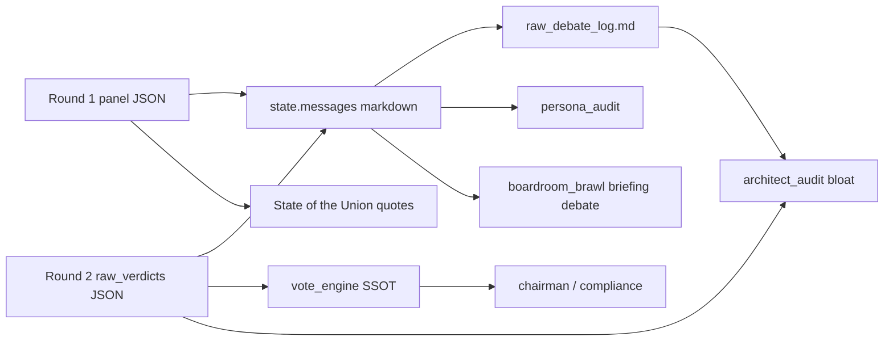

# Debate Quality & Systems Architect Handoff

**Status:** Active handoff (local WIP — not yet deployed)  
**Last updated:** May 31, 2026  
**Owner:** Stan  
**Audience:** Systems Architect QA agent, Prompt Engineer QA agent, and supervising agents reviewing debate pipeline / post-flight QA.

**Related:** [`action_tracker.md`](action_tracker.md) · [`agent_architecture.md`](agent_architecture.md) §6 · [`qa_layers.md`](qa_layers.md) · [`hr_qa_roster_handoff.md`](hr_qa_roster_handoff.md) · [`product_principles.md`](product_principles.md)

---

## 1. Why this doc exists

May 31, 2026 working session with Stan: triaged three **P1** items from prod run **`20260531_014121`** that were failing **Prompt Engineer QA** and **Systems Architect QA**. All three are **fixed in code** on local `main` but **not yet committed or validated on prod**.

Stan’s working rules for this effort:

| Rule | Implication |
|------|-------------|
| **Analysis first** on tracker items; implement after agreement | Do not silently expand scope |
| **No LLM retries** to mask bad process | Fix prompts or Python at source; let QA FAIL loudly if still broken |
| **Deterministic QA + unit tests** = done for code; prod run = validation | Mark tracker items `done` pending prod |
| **Options with recommendation** when tradeoffs exist | Architect should propose, not guess |

---

## 2. Prod baseline (before this session)

Run **`20260531_014121`** (~4.5 min SUCCESS) on prod HEAD **`b6984fa`**.

| QA agent | Failure | Tracker ID |
|----------|---------|------------|
| Prompt Engineer | 3× CRITICAL persona drift — forbidden cross-persona vocab in Round 2 | **PE-PERSONA-1** |
| Prompt Engineer | Round 2 `overall_portfolio_critique` verbatim copy of Round 1 | **R2-1** |
| Systems Architect | Debate log bloat — 192 `\bPass\b` mentions / 27 symbols; 86/100 watchlist Pass rows | **PASS-SPAM-1** |

Evidence: `qa_reports_20260531_014121.json` (fetch via `tools/fetch_azure_reports.py --run-id 20260531_014121 --post-job`).

---

## 3. What shipped (local WIP)

### 3.1 PE-PERSONA-1 — Round 2 persona drift (agent / prompt)

**Problem:** Panelists rebutting peers adopted the peer’s jargon (`margin of safety`, `relative strength`, `the tape`), triggering deterministic CRITICAL in `src/qa/persona_audit.py`.

**Root cause:** Round 2 prompt required citing peer Round 1 claims without requiring vocabulary translation.

**Fix:** `[ANTI-DRIFT PROTOCOL]` block in `build_round2_user_prompt()` (`src/core/rebuttal.py`).

**Not changed:** `FORBIDDEN_PHRASES` map or audit thresholds — detection stays strict.

**Tests:** `tests/test_persona_audit.py`, `tests/test_rebuttal.py`

---

### 3.2 R2-1 — Round 2 overview verbatim copy of Round 1 (agent / prompt)

**Problem:** `overall_portfolio_critique` in Round 2 duplicated Round 1 Portfolio Overview → `VERBATIM R1 COPY` CRITICAL (`is_verbatim_r1_copy`, ≥82% word overlap).

**Fix (prompt only, no retry):** Round 2 task item 1 in `build_round2_user_prompt()` now requires:

- **First sentence** must name another panelist and respond to their Round 1 claim.
- **≥50% new wording** vs the Round 1 block shown above.

**Not changed:** SoTU still uses Round 1 critiques (`src/core/state_of_union.py`) — briefing unaffected.

**Rejected approach:** Python retry loop in `execute_rebuttal_round()` — Stan explicitly declined (retries mask bad process).

**Tests:** `tests/test_rebuttal.py`, `tests/test_persona_audit.py` (`test_verbatim_r1_copy_detected_in_persona_audit`)

---

### 3.3 PASS-SPAM-1 — Watchlist Pass log bloat (code)

**Problem:** Two Systems Architect deterministic checks failed:

| Check | Module | Signal |
|-------|--------|--------|
| `audit_debate_log_bloat` | `architect_audit.py` | 192 `\bPass\b` in raw markdown log |
| `audit_watchlist_pass_spam` | `architect_audit.py` | 86/100 watchlist rows Pass in `raw_verdicts` |

**Root cause:** `engine.py` emitted one markdown line per watchlist Pass × 5 panelists × 2 rounds. High Pass **rate** on a large watchlist is **expected**; the bloat was **representation**, not bad votes.

**Fix (A + B + C):**

| Layer | Change |
|-------|--------|
| **A — Slim markdown** | `engine.py` uses `format_watchlist_verdict_markdown_lines()` — Buys individual; Passes aggregated to one line per panelist per round (`no buy case (N names)` — avoids `\bPass\b` spam) |
| **B — Shared module** | New `src/core/debate_format.py`; `boardroom_brawl.py` imports shared filter/format helpers (investor debate already omitted Pass rows) |
| **C — Audit reframe** | `audit_watchlist_pass_spam()` flags **≥8 identical Pass analyses** (≥20 chars), not high Pass rate |

**Invariant:** `raw_verdicts` JSON unchanged — `vote_engine` SSOT preserved. Post-mortem prose-vs-JSON check skips empty prose when JSON has a verdict.

**Tests:** `tests/test_debate_format.py`, `tests/test_architect_audit.py`, `tests/test_boardroom_brawl.py`

---

## 4. File map (touch these first)

| Path | Role |
|------|------|
| `src/core/debate_format.py` | **New** — markdown formatting + brawl ticker filters |
| `src/core/engine.py` | Round 1/2 message assembly (slim watchlist) |
| `src/core/rebuttal.py` | Round 2 user prompt (anti-drift, R2-1 wording rules) |
| `src/core/boardroom_brawl.py` | Investor-facing debate; now DRY with `debate_format` |
| `src/qa/persona_audit.py` | Deterministic persona gate (unchanged logic; consumes slimmed log) |
| `src/qa/architect_audit.py` | Systems Architect pre-check (reframed watchlist Pass rule) |
| `docs/action_tracker.md` | PE-PERSONA-1, R2-1, PASS-SPAM-1 marked **done** (pending prod) |

---

## 5. Systems Architect agent — operational notes

### 5.1 Deterministic gate (authoritative)

```text
audit_system_architect_deterministic()
  → chairman structure
  → raw_verdicts shape
  → repetitive synthesis
  → scratchpad bloat
  → debate log Pass mention count (markdown)
  → repetitive watchlist Pass analysis (JSON)
```

On **PASS**, LLM Systems Architect is **skipped** (`execution_mode: deterministic_pass`). On **FAIL**, LLM is also skipped — findings come from Python only (see `hr_qa_roster_handoff.md` §3.2).

### 5.2 Pass-mention threshold (unchanged)

Still flags when `pass_mentions >= max(72, symbol_count × 6)` on raw log. Slim markdown should drop a ~200-mention day to ~10 summary lines (no `\bPass\b` in aggregate line).

### 5.3 Do not regress

- Do **not** remove per-symbol Pass rows from **`raw_verdicts`** — breaks vote tallies.
- Do **not** add Round 2 **retries** for verbatim copy or persona drift without Stan sign-off.
- Do **not** relax `audit_debate_log_bloat` thresholds instead of slimming output — that hides token bloat.

---

## 6. Validation plan (post-deploy)

1. **Commit + deploy** local WIP (see §7).
2. **Manual prod run** — same kickoff as [`action_tracker.md`](action_tracker.md) Session Handoff.
3. **Fetch artifacts:**
   ```powershell
   .venv\Scripts\python.exe tools/fetch_azure_reports.py --run-id YYYYMMDD_HHMMSS --post-job
   ```
4. **Confirm Systems Architect deterministic PASS:**
   - No `Pass' mentions` bloat finding in `qa_reports_*.json`
   - No repetitive Pass analysis finding (unless panelists actually copy-paste)
5. **Confirm Prompt Engineer:**
   - No `PERSONA DRIFT` forbidden vocab CRITICALs
   - No `VERBATIM R1 COPY` CRITICALs
6. **Spot-check** `raw_debate_log_*.md` — each panelist round should show one `Watchlist — no buy case` summary instead of dozens of `Pass` lines.
7. **Unit tests:** `.venv\Scripts\python.exe -m unittest discover -s tests -v`

---

## 7. Git state (as of handoff)

**Modified:** `docs/action_tracker.md`, `src/core/rebuttal.py`, `src/core/engine.py`, `src/core/boardroom_brawl.py`, `src/qa/architect_audit.py`, `tests/test_rebuttal.py`, `tests/test_architect_audit.py`

**New:** `src/core/debate_format.py`, `tests/test_debate_format.py`

**Untracked (unrelated):** `assets/avatars/_recenter_proof.png`

**Not committed** — architect agent should treat this handoff + diff as source of truth until Stan requests commit/deploy.

---

## 8. Still open (adjacent — not in this session)

| ID | Pri | Notes for architect |
|----|-----|-------------------|
| **PE-SYCO-1** | P2 | Unanimous verdict buckets — persona_audit 60% threshold; separate from PE-PERSONA-1 |
| **HR-TELEM-1** | P1 | HR review on prod telemetry after deploy |
| **GFX-LLM-1** | P2 | Graphics Designer LLM parse error; deterministic chart audit PASS |
| **QA-HUMAN-1** | P0 | Gmail review of briefing / debate UX |

Full table: [`action_tracker.md`](action_tracker.md) Open items.

---

## 9. Human actions

| Who | Action |
|-----|--------|
| **Stan** | Review handoff; approve commit + deploy when ready |
| **Architect / implementer** | Run prod validation checklist (§6); update Session Handoff in `action_tracker.md` after first green run |
| **Supervisor** | Pre-push: scoped tests green; no forbidden API patterns (`scripts/pre_commit_check.py`) |

---

## 10. Quick reference — debate data flow



Markdown is for humans and QA excerpts; **votes and mandates come from `raw_verdicts` JSON only.**
