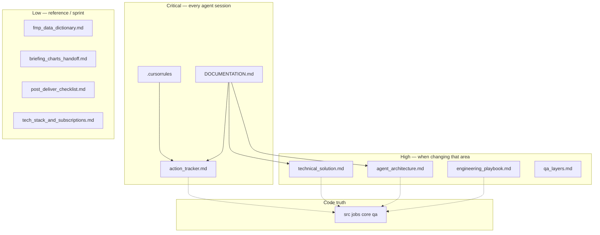

# Documentation health snapshot

**Status:** Active reference (not session handoff)  
**Reviewed:** May 29, 2026  
**SSOT for:** per-file health, impact on the solution, and remaining doc cleanup backlog  

**Live backlog for doc work:** [`action_tracker.md`](action_tracker.md) → Open items (Documentation).  
**Ongoing process:** [`doc_hygiene.md`](doc_hygiene.md). **Index:** [`DOCUMENTATION.md`](DOCUMENTATION.md).

---

## Executive summary

| Area | Score | Notes |
|------|------:|-------|
| AI dev hygiene (index, SSOT, thin Cursor rules) | 9/10 | Strong; keep `DOCUMENTATION.md` as hub |
| Operational clarity (today’s pickup) | 8/10 | Improved after tracker trim (~52 lines) |
| Architecture accuracy vs code | 7/10 | `technical_solution.md` still lags three-phase Azure |
| Reference docs (FMP, charts, QA map) | 8/10 | Appropriate depth |
| Growth control | 8/10 | `doc_hygiene.md` + archive; enforce monthly trim |

**Done (May 29):** Tracker/archive split, timer SSOT (6/7 AM `WEBSITE_TIME_ZONE`), agent rules in `.cursorrules` + `action_tracker.mdc`.

---

## Impact on the solution

| Impact | Documents | If wrong or bloated |
|--------|-----------|---------------------|
| **Critical** | `.cursorrules`, `action_tracker.md`, `DOCUMENTATION.md` | Wrong guardrails, wrong pickup, wasted tokens, repeated dead ends |
| **High** | `technical_solution.md`, `agent_architecture.md`, `qa_layers.md`, `engineering_playbook.md` | Bad architecture/QA changes, retried rejected fixes |
| **Medium** | `briefing_charts_handoff.md`, `fmp_data_dictionary.md`, `post_deliver_checklist.md` | Bad chart/API edits; sloppy post-deliver hygiene |
| **Low** | `README.md`, `agent_guardrails.md`, `.cursor/rules/*.mdc`, `tech_stack_and_subscriptions.md` | Entry friction; cost/plan drift |
| **Archive** | `archive/implementation_log_2026-05.md` | Read-only history; must not grow with new backlog |

---

## Per-document health (current)

| Document | Lines | Health | Impact | Notes |
|----------|------:|--------|--------|-------|
| [`DOCUMENTATION.md`](DOCUMENTATION.md) | 92 | **Excellent** | Critical | Master index; duplication rules |
| [`.cursorrules`](../.cursorrules) | 93 | **Excellent** | Critical | Guardrails, agents, §0.7 doc hygiene |
| [`engineering_playbook.md`](engineering_playbook.md) | 91 | **Excellent** | High | Rejected approaches — model doc |
| [`post_deliver_checklist.md`](post_deliver_checklist.md) | 103 | **Excellent** | Medium | Process + links to hygiene |
| [`qa_layers.md`](qa_layers.md) | 95 | **Good** | High | QA module map (not full diagrams) |
| [`README.md`](../README.md) | 27 | **Good** | Low | Thin entry |
| [`agent_guardrails.md`](agent_guardrails.md) | 5 | **Good** | Low | Pointer → `.cursorrules` |
| [`.cursor/rules/*.mdc`](../.cursor/rules/) | 10–18 | **Good** | Critical | Thin triggers only |
| [`doc_hygiene.md`](doc_hygiene.md) | 38 | **Good** | Critical | Ongoing trim process |
| [`action_tracker.md`](action_tracker.md) | 52 | **Good** | Critical | Was **Poor** (~552 lines); trimmed May 29 |
| [`briefing_charts_handoff.md`](briefing_charts_handoff.md) | 115 | **Good** | Medium | Sprint SSOT; fold after Graphics PASS |
| [`fmp_data_dictionary.md`](fmp_data_dictionary.md) | 221 | **Good** | Medium | API SSOT; keep backlog in tracker only |
| [`tech_stack_and_subscriptions.md`](tech_stack_and_subscriptions.md) | 87 | **Good** | Low | Timers fixed May 29 |
| [`agent_architecture.md`](agent_architecture.md) | 403 | **Fair–Good** | High | §9 overlap table vs tracker |
| [`technical_solution.md`](technical_solution.md) | 434 | **Fair** | High | Diagram/`main_batch` vs `src/jobs/` |
| [`archive/implementation_log_2026-05.md`](archive/implementation_log_2026-05.md) | 486 | **Archive** | Low | History only |

---

## Duplication rules (keep docs clean)

| Topic | Edit here | Do not copy into |
|-------|-----------|------------------|
| Guardrails, MCQ, Two Strike | `.cursorrules` | `agent_architecture.md`, `agent_guardrails.md` |
| Agent diagrams, QA stack | `agent_architecture.md` | `.cursorrules` |
| FMP endpoints | `fmp_data_dictionary.md` | `technical_solution.md` (link only) |
| Live backlog | `action_tracker.md` | Phase specs, doc tables, long DONE narratives |
| Rejected approaches | `engineering_playbook.md` | Tracker paragraphs |
| Resolved epics / old handoffs | `archive/` | `action_tracker.md` |

---

## Remaining cleanup (logged in action_tracker)

| ID | Priority | Effort | Action | Impact if skipped |
|----|----------|--------|--------|-------------------|
| DOC-1 | P2 | M | Sync `technical_solution.md` §1.2 diagram + post-flight QA placement to `prepare`→`debate`→`deliver` | Wrong deploy/debug mental model |
| DOC-2 | P2 | S | After Graphics QA PASS: fold QuickChart gotchas into playbook; shorten `briefing_charts_handoff.md` | Duplicate chart guidance |
| DOC-3 | P3 | S | Trim FMP action backlog tail in dictionary if duplicated in tracker | Two backlog SSOTs |
| DOC-4 | P3 | S | Keep `agent_architecture.md` §9 as design note only; priorities stay in tracker | Duplicate prioritization |
| DOC-5 | P2 | S | **Recurring:** monthly tracker trim / archive per `doc_hygiene.md` | Tracker bloat returns |

**One-time (done):** Tracker collapse, archive Phases 0–6, timer SSOT, `doc_hygiene.md`, agent wiring.

---

## Standard process (recurring)

| Cadence | Action |
|---------|--------|
| **Every deliver** | `post_deliver_checklist.md` → update one Session Handoff; no new Phase sections |
| **When shipping** | Code + tests + one architecture doc + bump “Last updated” |
| **When approach fails twice** | One playbook bullet, not tracker prose |
| **Monthly or tracker > ~200 lines** | Archive per `doc_hygiene.md` |
| **Quarterly** | Re-read `technical_solution.md` vs `function_app.py` + `src/jobs/` |

---

## Scorecard (overall)

| Metric | Before review | After May 29 hygiene |
|--------|---------------|----------------------|
| `action_tracker.md` lines | ~552 | ~52 |
| Agent reads per session (tracker) | Full file | Handoff + open items |
| Timer doc accuracy | Mixed 11:00 UTC | 6/7 AM `WEBSITE_TIME_ZONE` |
| Archive for history | None | `docs/archive/` |
| Written maintenance process | Implicit | `doc_hygiene.md` |

Update this snapshot when a doc cleanup tranche ships (bump **Reviewed** date, move items to Recently shipped in tracker).
