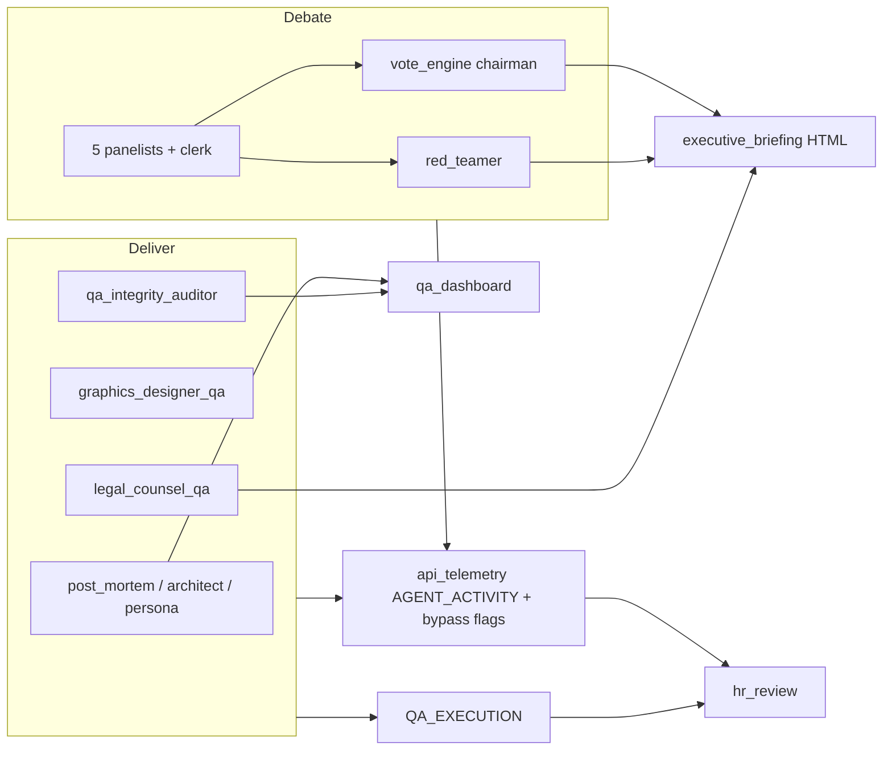

# HR Efficiency & QA Roster Handoff

**Status:** Active handoff  
**Last updated:** May 30, 2026 (partial deploy — see §9)  
**Owner:** Stan  
**SSOT for:** Agent utilization reporting, post-flight QA LLM augmentation policy, and roster governance philosophy (improve before cut).

**Related:** [`agent_architecture.md`](agent_architecture.md) §3 · [`engineering_playbook.md`](engineering_playbook.md) (AGENT_ACTIVITY) · [`agent_optimization_handoff.md`](agent_optimization_handoff.md) · Action Tracker **5.4** (HR Efficiency Consultant)

---

## 1. Why this doc exists

A May 30 session ran the **HR Efficiency Consultant** against run `20260530_190325`, reviewed token spend vs. value, and corrected several **false negatives** in HR output (agents marked “idle” that were actually working via Python bypass or deterministic QA). Stan’s direction: **retain and improve agents** (prompts, augmentation policy) rather than cut headcount — especially **red_teamer**, **chairman**, and **legal_counsel**.

This handoff captures product decisions, what shipped in code, and how to operate it after deploy.

---

## 2. Product decisions (Stan, May 30, 2026)

| Topic | Decision |
|-------|----------|
| **red_teamer** | **Keep.** Bear case + Unicorn Protocol rebuttals are in the executive briefing (Alpha Pick, Unicorn section). Not fed into allocation math — that is intentional. |
| **chairman** | **Keep.** Often **vote_engine** (Python) on clear-majority days; Pro LLM chairman remains for ambiguous runs. **Roadmap:** per-user investment style — user picks a “chairman” persona from panelists to bias portfolio strategy (aggressive default for Stan; conservative for others). |
| **legal_counsel_qa / legal_counsel_code** | **Keep.** Briefing legal review in deliver; codebase audit is on-demand (`legal_code_audit` job). |
| **qa_integrity_auditor** | **Keep** (do not merge into “master QA” for now). Cross-checks other QA agents; bills tokens on deliver. |
| **data_oracle** | **Not LLM headcount** — deterministic price gate in prepare. HR shows **INFRA**, not “failed agent.” |
| **post_mortem / prompt_engineer / system_architect** | **Improve, don’t cut.** Zero tokens on green runs was **Python PASS**, not broken agents. Augmentation policy now invokes Gemini when useful. |
| **HR CUT recommendations** | Treat as **stale** for the above roles until prompts and `QA_EXECUTION` telemetry are reviewed on a **post-deploy** run. |

---

## 3. What shipped (code)

### 3.1 HR utilization & consultant (`src/hr_review.py`)

- **`build_utilization(activity, telemetry=None)`** — merges `AGENT_ACTIVITY` with full `board_members` roster; attaches **`status`** per agent.
- **`resolve_execution_status()`** — uses `QA_EXECUTION`, `chairman_bypassed`, `compliance_source`, and infra/on-demand rules.
- **`idle`** — only `NOT_INVOKED` (true missing wiring), not vote-engine or deterministic QA.
- **`PIPELINE_DATAFLOW_NOTE` / `HR_SYSTEM_INSTRUCTION`** — red_teamer briefing consumption; chairman roadmap; **IMPROVE** verdict type; prefer improve over CUT.
- **`run_hr_efficiency_review(activity, raw_log, telemetry)`** — weekly digest passes full telemetry (see `qa_review.py`).

**Status labels (table):**

| Status | Meaning |
|--------|---------|
| `OK` | Gemini invocations recorded |
| `VOTE_ENGINE` | Chairman allocation via Python vote engine |
| `PYTHON_GATE` | Compliance deterministic-only (typical on vote-engine days) |
| `DET_PASS` | QA agent ran; Python pre-check PASS, no LLM (legacy runs infer this for trio) |
| `INFRA` | data_oracle (no LLM) |
| `ON_DEMAND` | legal_counsel_code (not daily deliver) |
| `LLM (BORDERLINE)` / `LLM (SPOT)` / `LLM (FAIL)` / `LLM_OK` | From `QA_EXECUTION` on new runs |
| `NOT_INVOKED` | No activity and no known bypass path |

### 3.2 QA LLM augmentation (`src/qa/qa_augmentation.py` + `src/qa_pipeline.py`)

Central policy helpers:

| Agent | LLM runs when |
|-------|----------------|
| **prompt_engineer** | Deterministic persona **FAIL**, or PASS with unanimous rate **≥ 45% and &lt; 60%** (borderline consensus) |
| **system_architect** | Deterministic structural/bloat checks only — **no LLM on FAIL** (May 30; saves tokens; `test_architect_audit` SSOT). |
| **post_mortem_qa** | Existing path on deterministic **FAIL**; on PASS: **spot-check** (Flash) if procedural drift warnings **or** vote-engine scratchpad (`PYTHON VOTE ENGINE` / `VOTE ENGINE ALLOCATION`) |

Each post-flight report includes:

- `execution_mode` — e.g. `deterministic_pass`, `llm_borderline`, `llm_spot_check`, `llm_fail`, `llm_active`
- `agent_key` — config key for telemetry

**Deliver** merges into canonical telemetry:

```json
"QA_EXECUTION": {
  "post_mortem_qa": "llm_spot_check",
  "prompt_engineer": "deterministic_pass",
  ...
}
```

### 3.3 Consumers updated

- `src/jobs/deliver.py` — writes `QA_EXECUTION`
- `src/qa_review.py` — HR gets full `telemetry_obj`
- `src/qa/post_job_audit.py`, `src/finance_oversight.py` — `build_utilization(..., telemetry=...)`

### 3.4 Tests

- `tests/test_hr_review.py` — status resolution, chairman not idle on bypass
- `tests/test_qa_augmentation.py` — augmentation thresholds and `extract_qa_execution`

---

## 4. How to run HR locally

```powershell
# Latest artifacts from Azure
.venv\Scripts\python.exe tools\fetch_azure_reports.py --run-id YYYYMMDD_HHMMSS

# Utilization table only (no extra Gemini call)
.venv\Scripts\python.exe -m src.hr_review .cache\state\api_telemetry_YYYYMMDD_HHMMSS.json

# Full consultant (table + KEEP/IMPROVE/… verdicts) — needs GEMINI_API_KEY in .env
# Wired in standing QA digest: src/qa_review.py (7 AM timer) when AGENT_ACTIVITY present
```

**Interpretation:**

- Runs **before** this deploy lack `QA_EXECUTION`; trio may show `DET_PASS` without proving which augmentation path ran.
- **`chairman_bypassed: true`** in telemetry is healthy on vote-engine days, not a failure.
- Compare token spend using **OK** and **LLM_*** rows; ignore **VOTE_ENGINE / PYTHON_GATE / INFRA** for “waste” reviews.

---

## 5. Reference run (pre-augmentation deploy)

**Run ID:** `20260530_190325` (successful deliver)

| Observation | Detail |
|-------------|--------|
| Logged LLM spend | ~15 calls, ~214k tokens, ~$0.65 est. |
| Top cost | Five panelists (2× Pro rounds each) — expected |
| red_teamer | 1 call, ~18k tokens → briefing Alpha Pick + Unicorn |
| chairman / compliance | 0 tokens — vote_engine + python_only |
| QA trio | 0 tokens — deterministic PASS only (pre-augmentation) |
| legal_counsel | Not in `qa_reports` for this run (predates deliver wiring) |

---

## 6. Architecture reminders



**red_teamer** path: `engine.execute_red_team` → `debate.red_team_data` → `reporting.build_unicorn_protocol_items` + `bear_case_narrative` in template.

**Chairman** path: `engine.execute_chairman_arbitration` → if `can_determine_allocation()` → `build_chairman_allocation()` (no Pro call).

---

## 7. Follow-up tickets (suggested)

| ID | Priority | Task |
|----|----------|------|
| H1 | P1 | Re-run HR on **first deliver after deploy**; confirm `QA_EXECUTION` and spot-check / borderline LLM fire rates |
| H2 | P2 | **Prompt review pass** — `agents.py` system instructions for post_mortem, prompt_engineer, system_architect (prompts were written for LLM paths that were often skipped) |
| H3 | P2 | **Chairman persona selector** — user config → chairman prompt / vote weight bias (product + schema) |
| H4 | P3 | Optional: sample `llm_borderline` / `llm_spot_check` outputs into QA dashboard for Stan visibility |
| H5 | P3 | Engineering playbook bullet: HR status column + `QA_EXECUTION` (mirror AGENT_ACTIVITY note) |

---

## 8. Files touched (May 30 session)

| File | Change |
|------|--------|
| `src/hr_review.py` | Status column, telemetry-aware utilization, IMPROVE verdict, consultant prompt |
| `src/qa/qa_augmentation.py` | **New** — augmentation policy + `extract_qa_execution` |
| `src/qa_pipeline.py` | LLM wiring for trio; `execution_mode` on QA reports |
| `src/jobs/deliver.py` | Persist `QA_EXECUTION` |
| `src/qa_review.py` | Pass telemetry into HR |
| `src/qa/post_job_audit.py` | Telemetry-aware utilization |
| `src/finance_oversight.py` | Same |
| `src/qa/architect_audit.py`, `src/qa/persona_audit.py` | Docstring alignment |
| `tests/test_hr_review.py`, `tests/test_qa_augmentation.py` | **New** |

---

## 9. Human actions

### Deploy status (May 30, 2026)

| Piece | On prod (`9f26173`)? | Notes |
|-------|----------------------|-------|
| `src/qa/qa_augmentation.py` + `tests/test_qa_augmentation.py` | **Yes** | Architect = deterministic-only (no LLM on FAIL) |
| `src/qa_pipeline.py` augmentation + `execution_mode` on reports | **No** — WIP | Uncommitted local diff |
| `src/jobs/deliver.py` → `QA_EXECUTION` in telemetry | **No** — WIP | Run `20260530_205821` has `QA_EXECUTION: null` |
| `src/hr_review.py` status column + `resolve_execution_status` | **No** — WIP | Local `python -m src.hr_review` works on cached telemetry |
| `tests/test_hr_review.py`, this doc, doc cross-links | **No** — WIP | Commit + deploy as **HR-1** batch |

**H1 (partial):** HR table re-run on `20260530_205821` locally shows STATUS column (VOTE_ENGINE, DET_PASS, INFRA, OK) but **`QA_EXECUTION` absent** until deliver WIP ships.

### Next steps

1. **Commit + deploy HR-1 batch** — `hr_review.py`, `deliver.py`, `qa_pipeline.py`, consumers, `test_hr_review.py`, this doc + `DOCUMENTATION.md` / `agent_architecture.md` links.
2. After deploy: `fetch_azure_reports --run-id <id>` → `python -m src.hr_review ...` — confirm `QA_EXECUTION` in telemetry blob and LLM_* status labels.
3. If borderline persona LLM fires too often, tune `PERSONA_BORDERLINE_UNANIMOUS_RATE` in `qa_augmentation.py` (default `0.45`).
4. When starting chairman-per-user work, link design doc to §2 chairman row and `engine.execute_chairman_arbitration`.

---

*End of handoff.*
