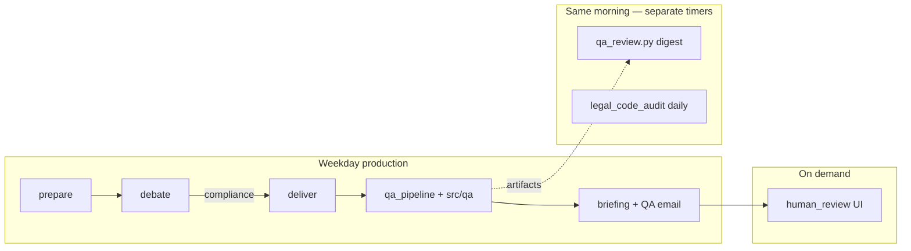

# QA Layers — Quick Map

**Status:** Active · **Last updated:** May 30, 2026 (Legal Counsel layer — staged)  
**SSOT for:** which QA module does what — **not** full layer diagrams (see [`agent_architecture.md`](agent_architecture.md) §6).

**Planned runtime wins (not yet implemented):** [`agent_optimization_handoff.md`](agent_optimization_handoff.md) §5 (Tickets A1–A4).

---

## The confusion (one sentence each)

| Module | Plain English |
|--------|----------------|
| `src/qa_pipeline.py` | **Per-run LLM QA** after each deliver — audits that day's debate and briefing |
| `src/qa/` | **Deterministic Python QA** — chart/HTML/integrity checks without trusting LLM self-grades |
| `src/qa_review.py` | **Separate daily digest** (~7 AM) — reviews latest Azure artifacts, not part of deliver |
| `src/qa/human_review.py` | **You** confirm QA accuracy via email link → Azure `/api/qa-review` |
| `src/qa/legal_audit.py` | **Legal Counsel** — deterministic briefing HTML + codebase scans for IP/endorsement/fair-use risk |
| `.cursor/rules/qa_validation_agent.mdc` | **Dev-time** — runs tests on commit, not production pipeline |

---

## When each runs

| When | What | Entry point |
|------|------|-------------|
| Every **deliver** | Post-flight LLM trio + graphics + integrity | `src/jobs/deliver.py` → `qa_pipeline` + `src/qa/*` |
| **~7 AM daily** (after pipeline window) | Standing QA + HR cost digest | `function_app.qa_review_daily_run` → `qa_review.py` |
| **~8 AM daily** | Legal Counsel codebase scan | `function_app.boardroom_legal_code_audit_daily` → `src/jobs/legal_code_audit.py` |
| **Every deliver** | Legal Counsel briefing scan | `deliver.py` → `qa_pipeline.run_legal_counsel_qa()` |
| **After QA email** | Human review form | `/api/qa-review` → `human_review.py` |
| **Git commit** | Unit tests + guardrail checks | `scripts/pre_commit_check.py` |

---

## Per-run deliver stack (read this when debugging QA email)

Order inside `deliver.py`:

| Step | Module | Type | Validates |
|------|--------|------|-----------|
| 1 | `qa_pipeline.run_post_flight_qa` | LLM ×3 | Procedure, JSON/pipeline, prompt drift |
| 2 | `reporting.audit_chart_health` | 🟢 Python | Chart URLs respond |
| 3 | `qa_pipeline.run_graphics_designer_qa` | 🟢 + 🟡 LLM | Final briefing HTML + images |
| 4 | `qa/scorecard.build_qa_scorecard` | 🟢 Python | Per-agent findings → telemetry |
| 5 | `qa_pipeline.run_qa_integrity_audit` | 🟢 + 🟡 LLM | QA-of-the-QA vs debate log + dashboard |
| 6 | `qa_pipeline.run_legal_counsel_qa` | 🟢 Python | Briefing HTML vs `legal_policy.py` patterns |
| 7 | Email | — | Briefing + QA dashboard (+ Legal Counsel report to Stan) |

Deterministic helpers live in **`src/qa/`**:

| File | Role |
|------|------|
| `visual_audit.py` | Email-safe HTML, missing charts/alt text |
| `integrity_audit.py` | Dashboard matches JSON reports; self-contradiction |
| `scorecard.py` | `QA_SCORECARD` in telemetry |
| `human_review.py` | Human-confirmed accuracy → blob + ledger |
| `legal_audit.py` | Briefing + codebase legal/compliance pattern scan |
| `legal_policy.py` | SaaS legal boundaries SSOT (endorsement, quotes, fair use) |
| `legal_delivery.py` | Persist findings + trigger Legal Counsel email |
| `retrospective.py` | Post-deliver candidate backlog items (optional) |

**Rule:** `reconcile_compliance()` in `qa_pipeline.py` forces FAIL if any CRITICAL finding — do not trust LLM `is_compliant` alone.

---

## Standing QA digest (`qa_review.py`) — not the same as deliver QA

| | Deliver QA | Standing QA |
|---|------------|-------------|
| **Trigger** | Every successful deliver | Azure timer daily |
| **Input** | This run's checkpoint + log | Latest blobs from Azure |
| **Output** | QA dashboard email (same run) | Separate QA digest email |
| **Roles** | 3 post-flight + graphics + integrity | 7 roles + HR (`QA_TEAM_CONFIG`) |

Overlap is intentional but confusing — consolidation is backlog (see `agent_architecture.md` §9).

---

## Debate-phase audit (before deliver QA)

| Layer | Module | When |
|-------|--------|------|
| **vote_engine** | `src/core/vote_engine.py` | After Round 2 — tallies, digest, optional chairman bypass |
| **guardrails + alignment** | `guardrails.py`, `chairman_alignment.py` | After chairman — max 3, 10% cap, wash-sale, majority buys |
| **compliance (Python)** | `compliance_audit.py` | Always — majority, originator, alpha, hedge |
| **compliance (LLM)** | Markopolos in `engine.py` | **Only when `allocation_source=llm`** — skipped on `vote_engine` days |
| **debate checkpoint** | `debate.json` | Includes `raw_verdicts` (structured Round 2 JSON) |

Failed compliance → no approved debate → **deliver never runs** → no post-flight QA for that run. **No retry** — failures are flagged `requires_expert_review` for prompt engineering and data quality.

**Symptom → start here:** compliance failure → `compliance_failure_{run_id}.json` + `debate_review_{run_id}.json` in state container (includes `raw_verdicts`, debate log, violations).

---

## Dev / Cursor plane

| Agent | File | When |
|-------|------|------|
| QA Validation | `.cursor/rules/qa_validation_agent.mdc` | Pre-commit (blocking) |
| Refactoring | `refactoring_agent.mdc` | Pre-commit (blocking) |
| API Optimization | `api_optimization_agent.mdc` | Post-job (advisory) |

See [`.cursorrules`](../.cursorrules) §2–§5 — do not duplicate here.  
**Cursor plane backlog (fetch sync, standing QA digest, human review loop):** [`cursor_dev_plane_handoff.md`](cursor_dev_plane_handoff.md).

---

## Where to look when something breaks

| Symptom | Start here |
|---------|------------|
| Wrong PASS/FAIL on QA dashboard | `qa_pipeline.reconcile_compliance`, `integrity_audit.py` |
| Broken charts in email | `reporting.audit_chart_health`, `visual_audit.py` |
| QA email link 403 | `human_review.build_review_url`, Azure `QA_REVIEW_*` settings |
| Weekly digest wrong | `qa_review.py`, latest `api_telemetry_*.json` in Azure |
| Golden regression | `tests/fixtures/visual_qa/`, `tests/fixtures/integrity_qa/` |

**Full L0–L7 diagram:** [`agent_architecture.md`](agent_architecture.md) §6.
