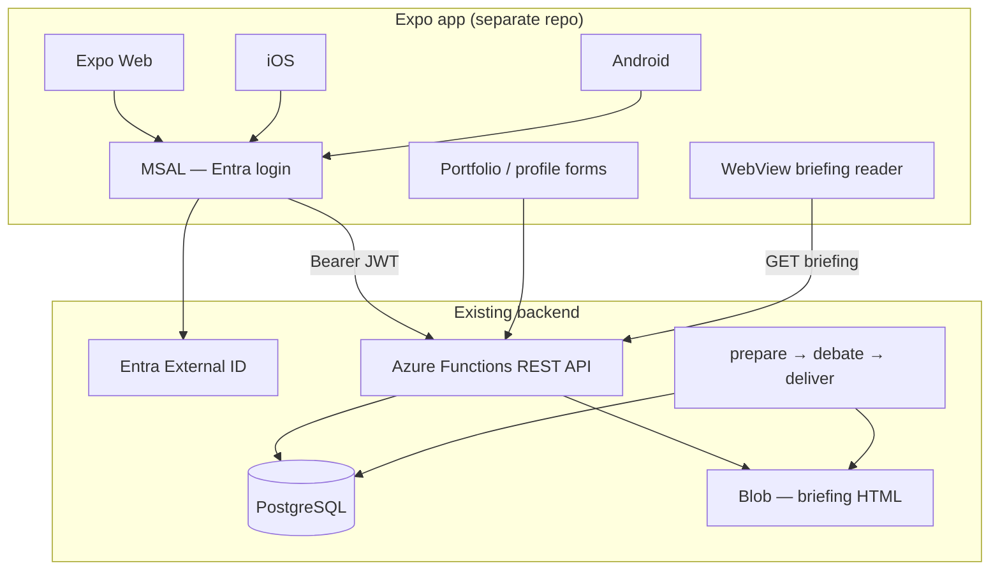

# SC Invest Boardroom — Client & Frontend Strategy

**Status:** Planning SSOT — **design and stack decisions; no client repo until backend API gate (Phase 4)**  
**Last updated:** May 30, 2026  
**Parent:** [`saas_technical_solution.md`](saas_technical_solution.md) · **Visual SSOT:** [`briefing_style.md`](briefing_style.md) · [`briefing_avatars.md`](briefing_avatars.md)

---

## 1. Purpose

This document captures **how customers will interact with Boardroom beyond email** — client stack, product surfaces, auth wiring, and build sequencing.

**Scope:** Forward-looking frontend architecture. **Not** tied to admin-provisioned beta (email-only). Backend work (Postgres, pipeline) proceeds independently; the client consumes a REST API when it exists.

**Decision (May 30):** **Expo (React Native)** as the single client codebase — **web first**, iOS/Android when product warrants App Store presence.

---

## 2. Product surfaces (what the client must do)

| Surface | Priority | v1 approach | Notes |
|---------|----------|-------------|-------|
| **Briefing reader** | P0 | WebView of server-generated HTML | Reuse `reporting.py` output — do not rebuild in RN components |
| **Portfolio entry** | P0 | Native forms (Expo) | Manual positions: symbol, shares, cost basis, purchase date, bucket |
| **Profile / mandate** | P1 | Native forms | Maps to `users.profile_json` — see [`saas_data_schema.md`](saas_data_schema.md) §6 |
| **Watchlist** | P1 | Native list + add/remove | |
| **Run history** | P2 | List + link to briefing | Metadata from Postgres `runs`; HTML from Blob via signed URL or API proxy |
| **Run Review** (operator) | P3 | Web-only admin | Votes → allocation → gate — [`product_principles.md`](product_principles.md) §6; may stay internal longer |
| **Push: briefing ready** | P3 | Native (Expo Notifications) | After App Store path; email remains primary |

**Email stays forever** as a delivery channel. The app is **additive** — read briefings in-app, manage portfolio, optional push.

---

## 3. Stack decision

### 3.1 Chosen: Expo + React Native + TypeScript

| Factor | Why Expo |
|--------|----------|
| **Solo + Cursor** | Models are strongest on React/TS; fastest iteration for one architect |
| **One codebase → web + native** | Ship web for portfolio CRUD first; same repo for iOS/Android later |
| **Entra External ID** | `@azure/msal-react-native` (or Expo-compatible MSAL wrapper) aligns with backend identity choice |
| **Build pipeline** | EAS Build — no local Xcode/Android Studio required for store releases |
| **Backend fit** | Python Azure Functions expose JSON REST; client is a thin consumer |

**Repo:** separate from this monorepo — e.g. `sc-invest-boardroom-app/` (or sibling directory). Do **not** embed Expo inside the Python pipeline repo.

### 3.2 Explicitly not chosen

| Stack | Reason |
|-------|--------|
| **Flutter** | Strong product, but Dart + widget tree is weaker in AI-assisted solo workflow; no Entra advantage over RN |
| **.NET MAUI** | XAML + C# misaligned with Python/Azure center of gravity |
| **Next.js only (no RN)** | Viable for web-only; rejected because long-term App Store path would require a second stack |
| **Clerk frontend** | Identity decision is Entra External ID — use MSAL, not Clerk components |

### 3.3 Briefing UI: WebView, not native rebuild

The executive briefing is **908+ lines of styled HTML** with QuickChart images, SoTU avatar rings, and inline email-safe CSS. **v1 rule:**

```text
Client fetches briefing HTML (or URL) → renders in WebView / iframe (web)
Do NOT reimplement Action Plan, charts, or SoTU in React Native components in v1
```

Native chrome wraps the WebView: header, date picker (run history), Stealth Wealth nav shell. Visual SSOT remains `src/output/briefing_style.py` + [`briefing_style.md`](briefing_style.md).

---

## 4. System context



**Auth split:**

| Context | Mechanism |
|---------|-----------|
| **Expo client (mobile + web)** | MSAL acquires token → `Authorization: Bearer` on API calls |
| **Function App ops triggers** | Function key (unchanged) — not user-facing |
| **Easy Auth** | Optional for hosted web-only routes; MSAL in Expo is primary for cross-platform |

---

## 5. Visual & brand continuity

Client shell must match **Stealth Wealth** — quiet authority, not a generic fintech template.

| Token | Source | Client usage |
|-------|--------|----------------|
| Canvas `#121212`, card `#1e1e1e` | [`briefing_style.md`](briefing_style.md) | App background, nav, tab bar |
| Sage `#95b8a2` | same | Headers, active tab, primary button |
| Body `#a1a1aa`, strong `#f4f4f5` | same | Form labels, list text |
| Panel avatars | [`briefing_avatars.md`](briefing_avatars.md) | SoTU strip, settings “your board” marketing |

**Implementation:** export a shared `theme.ts` in the client repo, manually synced from `briefing_style.py` constants until a codegen step is worth it. Do not fork palette values without updating both docs.

---

## 6. API contract (client expectations)

Backend API is **not implemented yet** — this is the target surface for Phase 4. Client development can mock against these shapes.

### 6.1 Auth

```http
Authorization: Bearer <Entra access token>
```

API validates JWT (Entra issuer, audience = Boardroom app registration). Resolves `users.id` via `entra_oid` or email claim.

### 6.2 Endpoints (illustrative)

| Method | Path | Purpose |
|--------|------|---------|
| `GET` | `/api/me` | Current user + `profile_json` |
| `PATCH` | `/api/me` | Update profile |
| `GET` | `/api/portfolios` | List buckets |
| `POST` | `/api/portfolios` | Create bucket |
| `GET` | `/api/portfolios/{id}/positions` | List positions |
| `PUT` | `/api/portfolios/{id}/positions` | Upsert positions (batch) |
| `GET` | `/api/watchlist` | Watchlist symbols |
| `GET` | `/api/runs` | Run history (paginated) |
| `GET` | `/api/runs/{run_id}/briefing` | HTML body or signed Blob URL |

All responses scoped to authenticated `user_id`. OpenAPI spec to live in `docs/openapi/boardroom-api.yaml` when Phase 4 starts.

---

## 7. Client repo layout (target)

```text
sc-invest-boardroom-app/
  app/                    # Expo Router file-based routes
    (auth)/
      sign-in.tsx
    (tabs)/
      briefing.tsx        # WebView reader
      portfolio.tsx       # Positions CRUD
      profile.tsx
  src/
    api/                  # fetch wrappers, typed from OpenAPI
    auth/msalConfig.ts
    theme/stealthWealth.ts
  app.json
  eas.json                # EAS Build profiles (when native ships)
```

**Tooling:** TypeScript strict, Expo SDK current stable, React Query (or TanStack Query) for API cache, Zod for form validation.

---

## 8. Implementation phases (client track)

Independent of pipeline Phase 0 stabilization — but **API must exist before client ships to real users**.

| Phase | Client deliverable | Depends on |
|-------|-------------------|------------|
| **C0 — Design** | This doc + wireframes + `theme.ts` | Nothing |
| **C1 — Scaffold** | Expo repo, Stealth Wealth shell, mock API | Nothing |
| **C2 — Auth** | MSAL + Entra External ID login (web) | Backend Phase 4 Entra tenant |
| **C3 — Portfolio** | Forms → live API | Backend `/api/portfolios` + Postgres |
| **C4 — Briefing reader** | WebView + run list | Backend `/api/runs` + Blob access |
| **C5 — Native stores** | EAS Build, iOS/Android, push optional | C2–C4 stable on web |

```text
Recommended build order:
  Backend: Postgres (2a) → REST API + Entra (4) → then client C2–C4
  Parallel safe:  C0 + C1 with mocks while backend catches up
```

---

## 9. What not to build yet

- Native reimplementation of briefing sections (Action Plan, charts, SoTU)
- Animated “financial avatar” state machines in the client (panel personas live in the **pipeline**, not the app shell)
- Offline-first sync or local portfolio DB
- App Store submission before web client validates UX with real API
- Embedding Expo inside `sc-invest-boardroom` Python repo

---

## 10. Cursor / solo-dev workflow

| Task | Where to work |
|------|----------------|
| Pipeline, agents, briefing HTML | This repo (`sc-invest-boardroom`) |
| Client UI, MSAL, forms, navigation | Client repo (`sc-invest-boardroom-app`) |
| Shared constants (colors) | Duplicate manually until codegen; document in both places |

Open client repo in Cursor separately or as workspace folder. Point Cursor at this doc + `saas_data_schema.md` for API field names.

---

## 11. Costs (client-specific)

| Item | Estimate |
|------|----------|
| Expo / EAS | Free tier sufficient for dev; production builds ~$29/mo EAS plan when native ships |
| Apple Developer | $99/yr when iOS ships |
| Google Play | $25 one-time when Android ships |
| Entra External ID | First 50k MAU free |

Add to [`subscriptions_registry.json`](subscriptions_registry.json) when first invoice hits.

---

## References

| Topic | Doc |
|-------|-----|
| SaaS backend architecture | [`saas_technical_solution.md`](saas_technical_solution.md) |
| Postgres entities | [`saas_data_schema.md`](saas_data_schema.md) |
| Entra identity | [`saas_technical_solution.md`](saas_technical_solution.md) §13 |
| Briefing visual SSOT | [`briefing_style.md`](briefing_style.md) |
| Avatar art direction | [`briefing_avatars.md`](briefing_avatars.md) |
| Run Review product need | [`product_principles.md`](product_principles.md) §6 |
