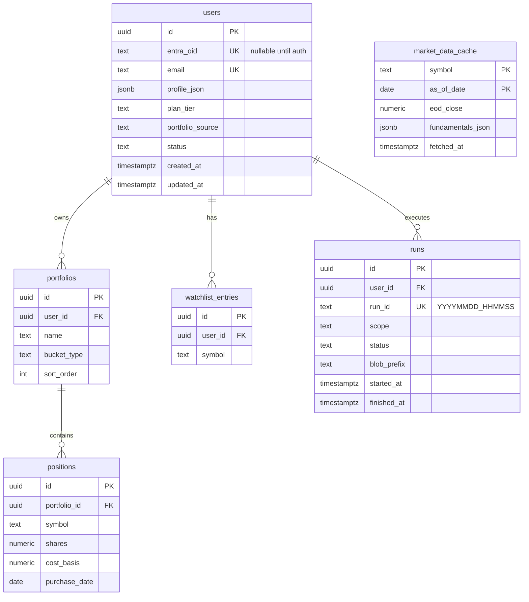

# SC Invest Boardroom — SaaS Data Schema (Postgres)

**Status:** Planning SSOT — **schema design only; no provisioning until Phase 2 gate**  
**Last updated:** May 30, 2026  
**Parent:** [`saas_technical_solution.md`](saas_technical_solution.md) · **Rollout:** [`saas_postgres_rollout.md`](saas_postgres_rollout.md)

---

## 1. Purpose

This document is the **single source of truth** for Postgres table definitions, tenant isolation rules, and JSON profile shapes for multi-user Boardroom.

**Storage split (do not merge):**

| Store | Holds |
|-------|--------|
| **Postgres** | Users, portfolios, positions, watchlist, run metadata, shared market cache |
| **Azure Blob** | HTML briefings, debate logs, QA dashboards, telemetry, checkpoints (large / append-only) |
| **Entra External ID** | Credentials and sessions only — no portfolio data ([`saas_technical_solution.md`](saas_technical_solution.md) §13) |

---

## 2. Design principles

1. **`users.id` (UUID) is the tenant key everywhere** — queue messages, blob prefixes, FKs. Never use email as PK.
2. **`entra_oid` is nullable until self-service auth** — admin-provisioned beta users have `entra_oid = NULL`; link when Entra account is created.
3. **Application-level tenant scoping** — every query includes `WHERE user_id = :user_id` (or joins through `portfolios.user_id`). Row-level security optional post-MVP.
4. **Portfolio source type is explicit** — `users.portfolio_source` drives `CsvPortfolioSource` vs `ManualPortfolioSource` vs future paths.
5. **Run artifacts stay in Blob** — `runs` table stores metadata + blob prefix only; not debate HTML in Postgres.
6. **Migrations are versioned** — SQL files under `db/migrations/` (created in Phase 2); never hand-edit prod without a migration.

---

## 3. Entity relationship



---

## 4. Table definitions

### 4.1 `users`

One row per external customer (Stan, beta friends, future subscribers).

| Column | Type | Constraints | Notes |
|--------|------|-------------|-------|
| `id` | `UUID` | PK, default `gen_random_uuid()` | Tenant key for pipeline and blob paths |
| `slug` | `TEXT` | UNIQUE, NOT NULL | Stable short id for ops (`stan`, `friend-jane`); display/email only — **not** blob paths |
| `entra_oid` | `TEXT` | UNIQUE, NULL allowed | Entra `oid` claim; NULL for admin-provisioned users until login enabled |
| `email` | `TEXT` | UNIQUE, NOT NULL | Briefing delivery address |
| `display_name` | `TEXT` | | Human label |
| `profile_json` | `JSONB` | NOT NULL, default `'{}'` | Mandate inputs — see §6 |
| `plan_tier` | `TEXT` | NOT NULL, default `'beta'` | `beta` \| `free` \| `pro` \| `paused` |
| `portfolio_source` | `TEXT` | NOT NULL | `csv` \| `manual` — which `PortfolioSource` impl |
| `status` | `TEXT` | NOT NULL, default `'active'` | `active` \| `paused` \| `deleted` |
| `created_at` | `TIMESTAMPTZ` | NOT NULL, default `now()` | |
| `updated_at` | `TIMESTAMPTZ` | NOT NULL, default `now()` | |

**Indexes:** `users_email_idx` on `email`; `users_entra_oid_idx` on `entra_oid` WHERE `entra_oid IS NOT NULL`; `users_status_active_idx` on `(status)` WHERE `status = 'active'`.

### 4.2 `portfolios`

Account buckets — maps from today's `ACCOUNT_ORDER` in `src/pipeline.py`.

| Column | Type | Constraints | Notes |
|--------|------|-------------|-------|
| `id` | `UUID` | PK | |
| `user_id` | `UUID` | FK → `users.id` ON DELETE CASCADE | |
| `name` | `TEXT` | NOT NULL | e.g. `eTrade Taxable`, `Roth IRA` |
| `bucket_type` | `TEXT` | NOT NULL, default `'custom'` | `taxable` \| `roth` \| `401k` \| `custom` |
| `sort_order` | `INT` | NOT NULL, default `0` | Chart legend order |
| `created_at` | `TIMESTAMPTZ` | NOT NULL, default `now()` | |

**Unique:** `(user_id, name)`.

### 4.3 `positions`

Manual entry for SaaS users; loaded from CSV for Stan during migration.

| Column | Type | Constraints | Notes |
|--------|------|-------------|-------|
| `id` | `UUID` | PK | |
| `portfolio_id` | `UUID` | FK → `portfolios.id` ON DELETE CASCADE | |
| `symbol` | `TEXT` | NOT NULL | Uppercase ticker |
| `shares` | `NUMERIC(18,6)` | NOT NULL, CHECK `shares >= 0` | |
| `cost_basis` | `NUMERIC(18,2)` | | Total cost or per-share — document in loader; prefer total |
| `purchase_date` | `DATE` | | Forward TWR anchor; NULL = use user signup date |
| `updated_at` | `TIMESTAMPTZ` | NOT NULL, default `now()` | |

**Unique:** `(portfolio_id, symbol)`.

### 4.4 `watchlist_entries`

| Column | Type | Constraints |
|--------|------|-------------|
| `id` | `UUID` | PK |
| `user_id` | `UUID` | FK → `users.id` ON DELETE CASCADE |
| `symbol` | `TEXT` | NOT NULL |
| `created_at` | `TIMESTAMPTZ` | NOT NULL, default `now()` |

**Unique:** `(user_id, symbol)`.

### 4.5 `runs`

Pipeline run registry — links Postgres user to Blob artifacts.

| Column | Type | Constraints | Notes |
|--------|------|-------------|-------|
| `id` | `UUID` | PK | Internal |
| `user_id` | `UUID` | FK → `users.id` | |
| `run_id` | `TEXT` | UNIQUE, NOT NULL | Existing format `YYYYMMDD_HHMMSS` |
| `scope` | `TEXT` | NOT NULL, default `'all_portfolios'` | `all_portfolios` \| `portfolio:{uuid}` |
| `status` | `TEXT` | NOT NULL | `queued` \| `running` \| `success` \| `failed` \| `blocked` |
| `blob_prefix` | `TEXT` | NOT NULL | e.g. `boardroom-state/{user_id}/runs/{run_id}/` |
| `started_at` | `TIMESTAMPTZ` | | |
| `finished_at` | `TIMESTAMPTZ` | | |

**Indexes:** `runs_user_id_started_idx` on `(user_id, started_at DESC)`.

### 4.6 `market_data_cache`

Shared across all users — populated by future `market_sync` job (Phase 3).

| Column | Type | Constraints | Notes |
|--------|------|-------------|-------|
| `symbol` | `TEXT` | PK (composite) | |
| `as_of_date` | `DATE` | PK (composite) | Trading date |
| `eod_close` | `NUMERIC(18,4)` | | |
| `fundamentals_json` | `JSONB` | | FMP snapshot subset |
| `fetched_at` | `TIMESTAMPTZ` | NOT NULL | |

**Index:** `market_data_cache_symbol_date_idx` on `(symbol, as_of_date DESC)`.

---

## 5. Initial migration SQL (reference)

Target path: `db/migrations/001_initial_schema.sql` (create when implementing Phase 2).

```sql
-- Extensions
CREATE EXTENSION IF NOT EXISTS "pgcrypto";

-- users
CREATE TABLE users (
    id              UUID PRIMARY KEY DEFAULT gen_random_uuid(),
    slug            TEXT NOT NULL UNIQUE,
    entra_oid       TEXT UNIQUE,
    email           TEXT NOT NULL UNIQUE,
    display_name    TEXT,
    profile_json    JSONB NOT NULL DEFAULT '{}'::jsonb,
    plan_tier       TEXT NOT NULL DEFAULT 'beta'
                    CHECK (plan_tier IN ('beta', 'free', 'pro', 'paused')),
    portfolio_source TEXT NOT NULL DEFAULT 'manual'
                    CHECK (portfolio_source IN ('csv', 'manual')),
    status          TEXT NOT NULL DEFAULT 'active'
                    CHECK (status IN ('active', 'paused', 'deleted')),
    created_at      TIMESTAMPTZ NOT NULL DEFAULT now(),
    updated_at      TIMESTAMPTZ NOT NULL DEFAULT now()
);

CREATE INDEX users_status_active_idx ON users (status) WHERE status = 'active';
CREATE INDEX users_entra_oid_idx ON users (entra_oid) WHERE entra_oid IS NOT NULL;

-- portfolios
CREATE TABLE portfolios (
    id           UUID PRIMARY KEY DEFAULT gen_random_uuid(),
    user_id      UUID NOT NULL REFERENCES users(id) ON DELETE CASCADE,
    name         TEXT NOT NULL,
    bucket_type  TEXT NOT NULL DEFAULT 'custom'
                 CHECK (bucket_type IN ('taxable', 'roth', '401k', 'custom')),
    sort_order   INT NOT NULL DEFAULT 0,
    created_at   TIMESTAMPTZ NOT NULL DEFAULT now(),
    UNIQUE (user_id, name)
);

-- positions
CREATE TABLE positions (
    id             UUID PRIMARY KEY DEFAULT gen_random_uuid(),
    portfolio_id   UUID NOT NULL REFERENCES portfolios(id) ON DELETE CASCADE,
    symbol         TEXT NOT NULL,
    shares         NUMERIC(18, 6) NOT NULL CHECK (shares >= 0),
    cost_basis     NUMERIC(18, 2),
    purchase_date  DATE,
    updated_at     TIMESTAMPTZ NOT NULL DEFAULT now(),
    UNIQUE (portfolio_id, symbol)
);

-- watchlist_entries
CREATE TABLE watchlist_entries (
    id         UUID PRIMARY KEY DEFAULT gen_random_uuid(),
    user_id    UUID NOT NULL REFERENCES users(id) ON DELETE CASCADE,
    symbol     TEXT NOT NULL,
    created_at TIMESTAMPTZ NOT NULL DEFAULT now(),
    UNIQUE (user_id, symbol)
);

-- runs
CREATE TABLE runs (
    id           UUID PRIMARY KEY DEFAULT gen_random_uuid(),
    user_id      UUID NOT NULL REFERENCES users(id),
    run_id       TEXT NOT NULL UNIQUE,
    scope        TEXT NOT NULL DEFAULT 'all_portfolios',
    status       TEXT NOT NULL,
    blob_prefix  TEXT NOT NULL,
    started_at   TIMESTAMPTZ,
    finished_at  TIMESTAMPTZ
);

CREATE INDEX runs_user_id_started_idx ON runs (user_id, started_at DESC);

-- market_data_cache (Phase 3 — may ship in migration 002)
CREATE TABLE market_data_cache (
    symbol             TEXT NOT NULL,
    as_of_date         DATE NOT NULL,
    eod_close          NUMERIC(18, 4),
    fundamentals_json  JSONB,
    fetched_at         TIMESTAMPTZ NOT NULL,
    PRIMARY KEY (symbol, as_of_date)
);
```

---

## 6. `profile_json` shape

Replaces hardcoded values in `generate_dynamic_mandate()` (`src/core/schemas.py`) over time.

```json
{
  "date_of_birth": "1978-08-06",
  "target_retirement_age": 65,
  "monthly_contribution_usd": 500,
  "benchmark": "NASDAQ",
  "benchmark_alpha_target_pct": 5,
  "primary_panelist": "tesla",
  "risk_slider": 75,
  "conviction_slider": 80,
  "liquidation_cap_pct": 0.10,
  "max_daily_buys": 3,
  "asset_guidance": {
    "equity_target_pct": 100,
    "bond_etf_symbols": ["TLT", "BND"],
    "hedge_symbols": ["TLT", "VXX"]
  },
  "timezone": "America/Los_Angeles"
}
```

**Loader rule:** missing keys fall back to product defaults documented in code until profile UI exists.

---

## 7. Blob path convention

Per-user partition (Phase 2+):

```text
boardroom-state/{user_id}/runs/{run_id}/run_status.json
boardroom-state/{user_id}/runs/{run_id}/checkpoint_*.json
boardroom-reports/{user_id}/runs/{run_id}/executive_briefing_{run_id}.html
```

Stan legacy flat paths remain until migration script copies or dual-reads; new users use `user_id` prefix from day one. See [`saas_tenancy_gaps.md`](saas_tenancy_gaps.md) §3 T-1.

---

## 8. Admin-provisioned user (beta) — example row

No Entra account required. Operator (Stan) inserts via script or SQL:

```sql
INSERT INTO users (slug, email, display_name, portfolio_source, profile_json)
VALUES (
  'friend-jane',
  'jane@example.com',
  'Jane',
  'manual',
  '{"date_of_birth":"1985-03-15","target_retirement_age":65,"benchmark":"NASDAQ","benchmark_alpha_target_pct":5,"liquidation_cap_pct":0.10}'::jsonb
);
```

Then insert `portfolios` + `positions` for Jane. Pipeline selects `WHERE status = 'active'` and runs daily briefing to `email`.

When Entra is enabled later: create External ID user → set `users.entra_oid` → flip to self-service without schema change.

---

## 9. Stan migration mapping

| Today | Postgres |
|-------|----------|
| `STAN_PERSONAL_EMAIL` env | `users.email` where `slug = 'stan'` |
| `ACCOUNT_ORDER` buckets | four `portfolios` rows |
| CSV holdings in `DATA_DIR` | `positions` via one-time loader |
| `portfolio_source = 'csv'` initially | Switch to `'manual'` after loader validates |

---

## 10. Python access (Phase 2 target)

| Concern | Approach |
|---------|----------|
| Driver | `psycopg` (v3) or SQLAlchemy 2.x — match repo conventions when implementing |
| Connection | `DATABASE_URL` from env locally; Key Vault reference in Azure |
| Pooling | Small pool (2–5) on Functions; avoid new connection per queue message |
| Module home | `src/data/db.py` + `src/data/repositories/` (proposed) |

---

## References

| Topic | Doc |
|-------|-----|
| SaaS architecture | [`saas_technical_solution.md`](saas_technical_solution.md) |
| Postgres Azure rollout | [`saas_postgres_rollout.md`](saas_postgres_rollout.md) |
| Current CSV pipeline | [`technical_solution.md`](technical_solution.md) · `src/pipeline.py` |
