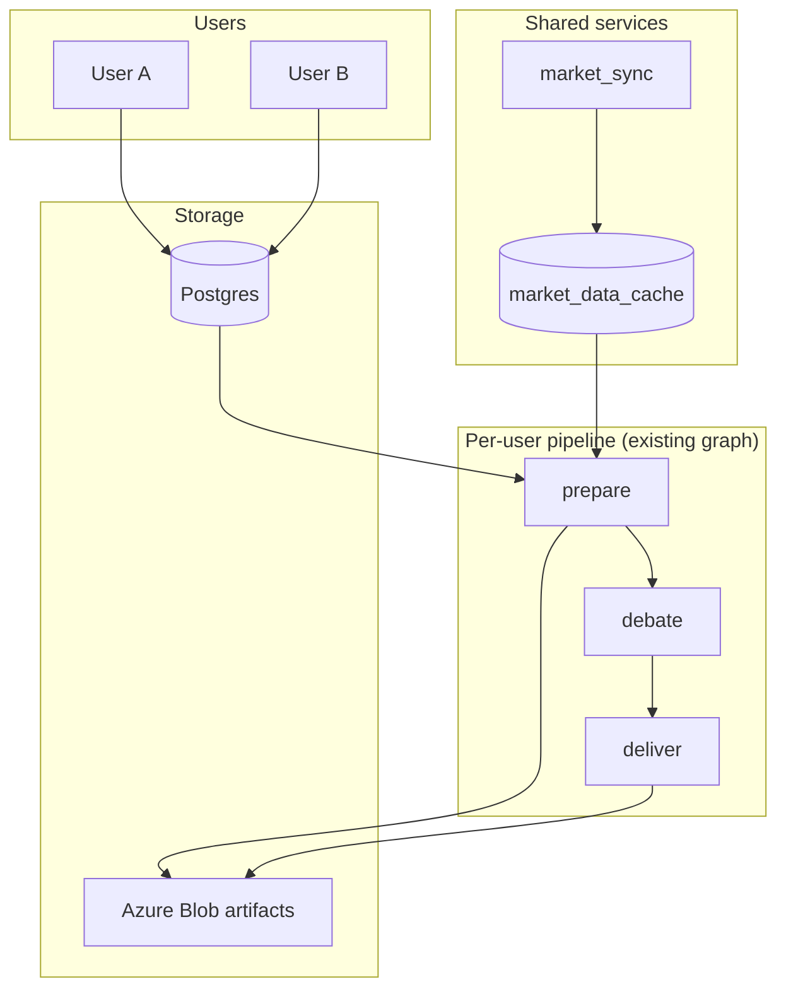

# SC Invest Boardroom — SaaS Technical Solution

**Status:** Planning — **do not implement until current environment is stabilized**  
**Last updated:** May 29, 2026  
**Companion:** [`technical_solution.md`](technical_solution.md) (today's single-tenant pipeline) · [`action_tracker.md`](action_tracker.md) (backlog gate)

---

## 1. Purpose

This document captures the **target technical architecture** for taking Boardroom to market as a multi-user product. It is a **design SSOT for future work**, not active implementation.

**Prerequisite:** Finish stabilizing and simplifying the existing single-tenant pipeline (vote engine prod validation, fail-closed compliance, core flow cleanup) before building any layer described here. See [`action_tracker.md`](action_tracker.md) § SaaS roadmap.

**Strategy:** Evolve the current repo (strangler pattern). Do **not** drop or rewrite the prepare → debate → deliver graph, vote engine, guardrails, or QA layers.

---

## 2. Product constraints (agreed)

| Constraint | Implication |
|------------|-------------|
| **Manual portfolio entry** (no broker CSV import at launch) | Avoids data-aggregation agreements and custody-adjacent posture; user attests to positions |
| **Forward-only performance** | TWR starts at declared `purchase_date` or signup; no imported transaction history |
| **Pre-tracking chart segment** | L12M / trend charts show gray or benchmark-only line before user's first tracked date |
| **Advisory / simulation only** | Recommendations in briefing; no order execution; legal disclaimers required before monetization |
| **Shared market data** | One batch fetch for core universe + union of user symbols — not N× FMP calls per user |
| **Generic agents later** | Parameterize mandates and prompts first; defer persona/roster changes per [`product_principles.md`](product_principles.md) §7 |

---

## 3. Mapping today's model to SaaS

### 3.1 What already exists

Today the pipeline uses **two related views** of holdings:

| View | Source | Used for |
|------|--------|----------|
| **`master_ledger`** | `pipeline.process_portfolios()` — symbol-centric, all accounts aggregated | Debate, vote engine, chairman allocation, Oracle price gate |
| **`account_holdings`** | `pipeline.build_account_holdings()` — per-bucket grouping | Pie charts, per-account TWR in `history.py` |

Account buckets are defined in `ACCOUNT_ORDER` (`eTrade Taxable`, `eTrade Roth IRA`, `Fidelity 401K`, `Fidelity Roth 401K`). This is the right **product shape** for user-defined portfolios.

### 3.2 SaaS entity model

```text
User
  ├── Profile (risk, horizon, plan tier — replaces hardcoded mandate in generate_dynamic_mandate)
  ├── Portfolio[]          ← "buckets" (maps from today's ACCOUNT_ORDER)
  │     └── Position[]     ← symbol, shares, cost_basis, purchase_date (manual entry)
  ├── Watchlist[]
  └── Run history[]        ← run_id, scope, verdicts, briefing artifacts
```

**Default advisory scope:** one daily board run **per user** on the **combined book** (aggregated `master_ledger`), with bucket breakdown in charts — same as today. Optional future: per-portfolio runs for users who want isolated mandates (higher Gemini cost).

---

## 4. Data model (target)

Persistence moves to **Postgres** (or equivalent) for entities; **Azure Blob** remains for run artifacts (HTML, debate logs, telemetry, checkpoints).

```text
users
  id, email, profile_json, plan_tier, created_at

portfolios
  id, user_id, name, type (taxable|roth|401k|custom), sort_order

positions
  id, portfolio_id, symbol, shares, cost_basis, purchase_date

watchlist_entries
  id, user_id, symbol

runs
  id, user_id, scope (all_portfolios | portfolio_id), status, started_at, finished_at

market_data_cache          ← shared across all users
  symbol, as_of_date, eod_close, fundamentals_json, fetched_at
```

**Stan migration:** four current account buckets → four `portfolios` for `user_id = stan`. One-time load from existing CSVs; CSV path becomes dev/power-user optional.

---

## 5. Ingestion: PortfolioSource abstraction

Introduce an interface so prepare does not depend directly on CSV parsing:

```text
PortfolioSource (interface)
  get_holdings(user_id, scope) → master_ledger, account_holdings, total_portfolio_value

Implementations:
  CsvPortfolioSource      ← current pipeline.py path (Stan / dev)
  ManualPortfolioSource   ← DB-backed (SaaS default)
```

`prepare.py` calls `PortfolioSource` instead of `pipeline.process_portfolios()` directly. Return shape **unchanged** so debate, reporting, and vote_engine require no rewrite on day one.

---

## 6. Market data: shared batch layer

Split today's per-run FMP work into two jobs:

| Job | Schedule | Responsibility |
|-----|----------|----------------|
| **`market_sync`** | Once daily (~5:50 AM, before user prepares) | Fetch EOD + fundamentals for core ~500 symbols **plus** union of all user portfolio symbols; write `market_data_cache` |
| **`prepare`** | Per user (queued, staggered) | Read cache; **on-demand fetch only on cache miss** (new ticker added since last sync); assemble mega-prompt |

Existing `prefetch_eod_cache` in `src/data/fmp_client.py` is the seed implementation for `market_sync`.

**FMP:** stay on current vendor through single-tenant scale-up; re-evaluate tier or split EOD vs fundamentals vendors when unique daily symbols × users exceeds Starter comfort. See [`tech_stack_and_subscriptions.md`](tech_stack_and_subscriptions.md).

---

## 7. Performance / TWR

| User type | Engine | Notes |
|-----------|--------|-------|
| **CSV + activity (Stan / dev)** | `history.py` | Full reconstruction from brokerage activity + FMP EOD — keep as-is |
| **SaaS manual entry** | `forward_twr.py` (new) | Mark-to-market from `purchase_date` forward; pre-purchase segment = gray benchmark line in charts |

Do not merge paths on day one; branch on portfolio source type.

---

## 8. Pipeline tenancy

Minimal orchestration changes on top of current Azure Functions pattern:

```text
Timer → enqueue {user_id, portfolio_scope} per eligible user
Queue messages carry tenant_id
Blob paths: boardroom-state/{user_id}/runs/{run_id}/...
Lock: per-user (replace global daily_execution.lock)
```

Core engine (`engine.py`, `vote_engine`, `guardrails`, `compliance_audit`) unchanged. **Prompt assembly** injects user profile instead of hardcoded mandate.

**Cost driver at scale:** Gemini tokens × users (not FMP × users, once shared cache exists). Meter per user for pricing tiers.

---

## 9. System context (target)



---

## 10. Implementation phases

| Phase | Deliverable | Gate |
|-------|-------------|------|
| **0 — Stabilize** | Commit/deploy current cleanup; prod validate vote_engine; simplify core flows | **Current work — must complete first** |
| **1 — Interface** | `PortfolioSource`; Stan unchanged behind `CsvPortfolioSource` | After Phase 0 |
| **2 — Entities** | Postgres + manual position CRUD; Stan as `user_id=stan` | After Phase 1 |
| **3 — Market cache** | `market_sync` job + shared cache; prepare reads cache | After Phase 2 |
| **4 — Tenancy** | Per-user queues, auth, blob partitioning, billing hooks | SaaS MVP |
| **5 — Growth** | Generic mandates, optional per-portfolio runs, forward TWR charts in briefing | Post-MVP |

---

## 11. Explicitly out of scope (until post-MVP)

- Broker OAuth / CSV import for retail users
- Live trade execution
- Rewriting agent roster or debate structure
- Replacing blob storage for artifacts
- Switching off FMP without telemetry-driven decision
- Full doc rewrite of [`technical_solution.md`](technical_solution.md) (sync incrementally)

---

## 12. Legal / product surface (reminder)

Before charging users: securities counsel review, disclaimers (not investment advice, user-entered data, no execution), privacy/data retention policy, tenant delete-on-request. Manual entry reduces aggregation risk but does not remove adviser-marketing considerations.

---

## References

| Topic | Doc |
|-------|-----|
| Current pipeline | [`technical_solution.md`](technical_solution.md) |
| Backlog gate | [`action_tracker.md`](action_tracker.md) |
| Product rules | [`product_principles.md`](product_principles.md) |
| Agents | [`agent_architecture.md`](agent_architecture.md) |
| FMP / costs | [`fmp_data_dictionary.md`](fmp_data_dictionary.md), [`tech_stack_and_subscriptions.md`](tech_stack_and_subscriptions.md) |
