# SC Invest Boardroom — SaaS Technical Solution

**Status:** Planning — **Phase 2 (Postgres) may start when Phase 0 gate clears; Entra self-service is Phase 4**  
**Last updated:** May 30, 2026  
**Companion:** [`technical_solution.md`](technical_solution.md) (today's single-tenant pipeline) · [`action_tracker.md`](action_tracker.md) (backlog gate)

**Child SSOT docs (May 30):**

| Doc | SSOT for |
|------|----------|
| [`saas_data_schema.md`](saas_data_schema.md) | Postgres tables, indexes, `profile_json`, migrations |
| [`saas_postgres_rollout.md`](saas_postgres_rollout.md) | Azure Postgres provisioning and beta rollout playbook |
| [`saas_client_strategy.md`](saas_client_strategy.md) | Expo client stack, product surfaces, API contract, build phases |
| [`saas_tenancy_gaps.md`](saas_tenancy_gaps.md) | Singleton inventory, tenant threading, hard decisions, greenfield vs evolve |

---

## 1. Purpose

This document captures the **target technical architecture** for taking Boardroom to market as a multi-user product. It is a **design SSOT for future work**, not active implementation.

**Prerequisite:** Finish stabilizing and simplifying the existing single-tenant pipeline (vote engine prod validation, fail-closed compliance, core flow cleanup) before building any layer described here. See [`action_tracker.md`](action_tracker.md) § SaaS roadmap.

**Strategy:** Evolve the current repo (strangler pattern). Do **not** drop or rewrite the prepare → debate → deliver graph, vote engine, guardrails, or QA layers.

**Identity decision (May 30):** **Microsoft Entra External ID** on Azure for customer login (Phase 4). **Postgres on Azure** for all entity data (Phase 2). Admin-provisioned beta users **do not require Entra** — same schema, `entra_oid` NULL until self-service.

**Client decision (May 30):** **Expo (React Native) + TypeScript** in a **separate repo** — web first, native later. See [`saas_client_strategy.md`](saas_client_strategy.md).

**Tenancy inventory (May 30):** Singleton migration, `user_id` threading, and greenfield decision — [`saas_tenancy_gaps.md`](saas_tenancy_gaps.md).

---

## 2. Product constraints (agreed)

| Constraint | Implication |
|------------|-------------|
| **Manual portfolio entry** (no broker CSV import at launch) | Avoids data-aggregation agreements and custody-adjacent posture; user attests to positions |
| **Forward-only performance** | TWR starts at declared `purchase_date` or signup; no imported transaction history |
| **Pre-tracking chart segment** | L12M / trend charts show gray or benchmark-only line before user's first tracked date |
| **Advisory / simulation only** | Recommendations in briefing; no order execution; legal disclaimers required before monetization |
| **Shared market data** | One batch fetch for core universe + union of user symbols — not N× FMP calls per user |
| **Generic agents later** | Parameterize mandates and prompts first; defer persona/roster changes per [`product_principles.md`](product_principles.md) §7 |
| **Admin-provisioned beta** | Operator (Stan) creates users in Postgres; friends receive email briefings without login until Entra Phase 4 |

---

## 3. Mapping today's model to SaaS

### 3.1 What already exists

Today the pipeline uses **two related views** of holdings:

| View | Source | Used for |
|------|--------|----------|
| **`master_ledger`** | `pipeline.process_portfolios()` — symbol-centric, all accounts aggregated | Debate, vote engine, chairman allocation, Oracle price gate |
| **`account_holdings`** | `pipeline.build_account_holdings()` — per-bucket grouping | Pie charts, per-account TWR in `history.py` |

Account buckets are defined in `ACCOUNT_ORDER` (`eTrade Taxable`, `eTrade Roth IRA`, `Fidelity 401K`, `Fidelity Roth 401K`). This is the right **product shape** for user-defined portfolios.

### 3.2 SaaS entity model

```text
User
  ├── Profile (risk, horizon, plan tier — replaces hardcoded mandate in generate_dynamic_mandate)
  ├── Portfolio[]          ← "buckets" (maps from today's ACCOUNT_ORDER)
  │     └── Position[]     ← symbol, shares, cost_basis, purchase_date (manual entry)
  ├── Watchlist[]
  └── Run history[]        ← run_id, scope, verdicts, briefing artifacts (metadata in Postgres; files in Blob)
```

**Default advisory scope:** one daily board run **per user** on the **combined book** (aggregated `master_ledger`), with bucket breakdown in charts — same as today. Optional future: per-portfolio runs for users who want isolated mandates (higher Gemini cost).

---

## 4. Data persistence (summary)

**Full schema:** [`saas_data_schema.md`](saas_data_schema.md)  
**Rollout steps:** [`saas_postgres_rollout.md`](saas_postgres_rollout.md)

| Store | Technology | Holds |
|-------|------------|-------|
| **Entity data** | Azure Database for PostgreSQL (Flexible Server) | users, portfolios, positions, watchlist, runs metadata, market_data_cache |
| **Run artifacts** | Azure Blob (existing) | HTML briefings, debate logs, telemetry, checkpoints |
| **Credentials** | Microsoft Entra External ID (Phase 4) | Passwords, OAuth, MFA — never in Postgres |

**Stan migration:** four current account buckets → four `portfolios` for `users.slug = 'stan'`. One-time load from existing CSVs; CSV path remains available via `portfolio_source = 'csv'` for dev.

---

## 5. Ingestion: PortfolioSource abstraction

Introduce an interface so prepare does not depend directly on CSV parsing:

```text
PortfolioSource (interface)
  get_holdings(user_id, scope) → master_ledger, account_holdings, total_portfolio_value

Implementations:
  CsvPortfolioSource      ← current pipeline.py path (Stan / dev)
  ManualPortfolioSource   ← Postgres-backed (SaaS default)
```

`prepare.py` calls `PortfolioSource` instead of `pipeline.process_portfolios()` directly. Return shape **unchanged** so debate, reporting, and vote_engine require no rewrite on day one.

---

## 6. Market data: shared batch layer

Split today's per-run FMP work into two jobs:

| Job | Schedule | Responsibility |
|-----|----------|----------------|
| **`market_sync`** | Once daily (~5:50 AM, before user prepares) | Fetch EOD + fundamentals for core ~500 symbols **plus** union of all user portfolio symbols; write `market_data_cache` |
| **`prepare`** | Per user (queued, staggered) | Read cache; **on-demand fetch only on cache miss** (new ticker added since last sync); assemble mega-prompt |

Existing `prefetch_eod_cache` in `src/data/fmp_client.py` is the seed implementation for `market_sync`.

**FMP:** stay on current vendor through single-tenant scale-up; re-evaluate tier or split EOD vs fundamentals vendors when unique daily symbols × users exceeds Starter comfort. See [`tech_stack_and_subscriptions.md`](tech_stack_and_subscriptions.md).

---

## 7. Performance / TWR

| User type | Engine | Notes |
|-----------|--------|-------|
| **CSV + activity (Stan / dev)** | `history.py` | Full reconstruction from brokerage activity + FMP EOD — keep as-is |
| **SaaS manual entry** | `forward_twr.py` (new) | Mark-to-market from `purchase_date` forward; pre-purchase segment = gray benchmark line in charts |

Do not merge paths on day one; branch on portfolio source type.

---

## 8. Pipeline tenancy

Minimal orchestration changes on top of current Azure Functions pattern:

```text
Timer → SELECT active users FROM Postgres
     → enqueue {user_id, user_slug, portfolio_scope} per eligible user
Queue messages carry tenant_id
Blob paths: boardroom-state/{user_id}/runs/{run_id}/...
Lock: per-user (replace global daily_execution.lock)
Email: users.email for delivery address
```

Core engine (`engine.py`, `vote_engine`, `guardrails`, `compliance_audit`) unchanged. **Prompt assembly** injects user profile from `users.profile_json` instead of hardcoded mandate.

**Cost driver at scale:** Gemini tokens × users (not FMP × users, once shared cache exists). Meter per user for pricing tiers.

**Daily pipeline does not use user login** — timer runs as system identity; auth gates only HTTP APIs and future self-service UI.

---

## 9. System context (target)

```mermaid
flowchart TB
    subgraph ExternalUsers["External users"]
        U1[User A]
        U2[User B]
        OP[Operator — Stan admin-provision]
    end

    subgraph Identity["Identity — Phase 4"]
        ENTRA[Microsoft Entra External ID]
    end

    subgraph Shared["Shared services"]
        MS[market_sync]
        MDC[(market_data_cache)]
        MS --> MDC
    end

    subgraph PerUser["Per-user pipeline (existing graph)"]
        PREP[prepare]
        DEB[debate]
        DEL[deliver]
        PREP --> DEB --> DEL
    end

    subgraph Storage
        PG[(Azure PostgreSQL)]
        BLOB[Azure Blob artifacts]
    end

    OP -->|INSERT users/portfolios| PG
    U1 -.->|login Phase 4| ENTRA
    U2 -.->|login Phase 4| ENTRA
    ENTRA -.->|entra_oid| PG
    PG --> PREP
    MDC --> PREP
    PREP --> BLOB
    DEL --> BLOB
    DEL -->|email| U1
    DEL -->|email| U2
```



---

## 10. Implementation phases

| Phase | Deliverable | Gate |
|-------|-------------|------|
| **0 — Stabilize** | Commit/deploy current cleanup; prod validate vote_engine; simplify core flows | **Current work — must complete first** |
| **1 — Interface** | `PortfolioSource`; Stan unchanged behind `CsvPortfolioSource` | After Phase 0 |
| **2a — Postgres** | Azure Postgres + schema ([`saas_postgres_rollout.md`](saas_postgres_rollout.md)); Stan migrated; `ManualPortfolioSource` | After Phase 1 |
| **2b — Multi-user beta** | Timer fan-out; admin-provisioned friends; per-user blob paths; operator scripts | After 2a validated for Stan |
| **3 — Market cache** | `market_sync` job + shared cache; prepare reads cache | After Phase 2b |
| **4 — Entra + self-service** | External ID tenant, REST API, MSAL client ([`saas_client_strategy.md`](saas_client_strategy.md)) | SaaS MVP login |
| **5 — Growth** | Stripe billing, generic mandates, forward TWR charts, optional per-portfolio runs | Post-MVP |

**Beta path (your immediate intent):** Phase **2a + 2b** — Postgres + admin-provisioned users, **no Entra yet**. Foundation is not throwaway.

---

## 11. Explicitly out of scope (until post-MVP)

- Broker OAuth / CSV import for retail users
- Live trade execution
- Rewriting agent roster or debate structure
- Replacing blob storage for artifacts
- Switching off FMP without telemetry-driven decision
- Full doc rewrite of [`technical_solution.md`](technical_solution.md) (sync incrementally)
- Salesforce as runtime data store (optional CRM mirror only — see architecture discussions)

---

## 12. Legal / product surface (reminder)

Before charging users: securities counsel review, disclaimers (not investment advice, user-entered data, no execution), privacy/data retention policy, tenant delete-on-request. Manual entry reduces aggregation risk but does not remove adviser-marketing considerations.

---

## 13. Identity — Microsoft Entra External ID (Phase 4)

**Decision:** Customer authentication uses **Microsoft Entra External ID** (Azure CIAM), not a third-party auth SaaS. Postgres remains the application system of record.

### 13.1 What Entra owns vs Postgres

| Entra External ID | Postgres `users` |
|-------------------|------------------|
| Email/password, social login, MFA | `email`, `display_name`, `profile_json` |
| Session tokens (JWT) | `id` (UUID tenant key) |
| `oid` claim | `entra_oid` (nullable until linked) |
| Password reset flows | `plan_tier`, `status` |
| Branding on hosted sign-in page | Portfolios, positions, watchlist |

### 13.2 External tenant setup (when Phase 4 starts)

1. Create **External ID tenant** (consumer / customer configuration).
2. Create **user flow** — email + password; restrict sign-up (invite-only or allowlist for beta).
3. Register **app** for Boardroom Function App (or future web UI).
4. Enable **Easy Auth** on `app-boardroom-prod` — Azure validates JWT before Python handlers run.
5. On first login: match email → `UPDATE users SET entra_oid = :oid WHERE email = :email`.
6. Store client ID/secret in **Key Vault** — not in repo.

**Pricing:** first 50,000 MAU/month free on Entra External ID Basic — irrelevant at beta scale.

Detailed portal steps: add to [`saas_postgres_rollout.md`](saas_postgres_rollout.md) §10 or a future `saas_entra_rollout.md` when Phase 4 is gated open.

### 13.3 Admin-provisioned users (Phase 2b — no Entra)

```text
Stan runs admin script → INSERT users (entra_oid NULL) + portfolios + positions
Timer → pipeline runs for all status='active' users
Briefing emailed to users.email
Friend never logs in — same rows later get entra_oid when self-service opens
```

No schema migration required when Entra goes live.

### 13.4 HTTP routes (Phase 4)

| Route | Auth | Purpose |
|-------|------|---------|
| `/api/prepare`, `/api/debate`, `/api/deliver` | Function key (ops) + eventually Entra for user-scoped | Pipeline triggers |
| `/api/portfolios/*` | Entra required | CRUD positions (future UI) |
| Timer / queue handlers | System (no user JWT) | Daily fan-out |

### 13.5 Billing (Phase 5 — Stripe)

Entra does **not** handle payments. Stripe Checkout + webhooks update `users.plan_tier` in Postgres. Pipeline checks `plan_tier` before enqueue.

---

## References

| Topic | Doc |
|-------|-----|
| **Postgres schema** | [`saas_data_schema.md`](saas_data_schema.md) |
| **Postgres rollout** | [`saas_postgres_rollout.md`](saas_postgres_rollout.md) |
| **Client / frontend** | [`saas_client_strategy.md`](saas_client_strategy.md) |
| **Tenancy gaps & migration inventory** | [`saas_tenancy_gaps.md`](saas_tenancy_gaps.md) |
| Current pipeline | [`technical_solution.md`](technical_solution.md) |
| Backlog gate | [`action_tracker.md`](action_tracker.md) |
| Product rules | [`product_principles.md`](product_principles.md) |
| Agents | [`agent_architecture.md`](agent_architecture.md) |
| FMP / costs | [`fmp_data_dictionary.md`](fmp_data_dictionary.md), [`tech_stack_and_subscriptions.md`](tech_stack_and_subscriptions.md) |
