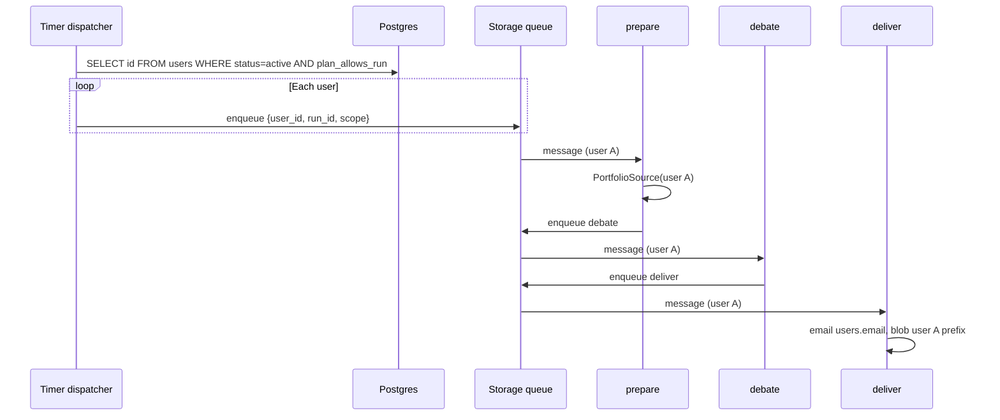

# SC Invest Boardroom — SaaS Tenancy Gaps & Migration Inventory

**Status:** Planning SSOT — **decisions and inventory for multi-user; implement during Phase 1–2**  
**Last updated:** May 30, 2026  
**Parent:** [`saas_technical_solution.md`](saas_technical_solution.md) · **Schema:** [`saas_data_schema.md`](saas_data_schema.md) · **Rollout:** [`saas_postgres_rollout.md`](saas_postgres_rollout.md)

---

## 1. Purpose

Multi-user SaaS is **not** “add Postgres.” It is **thread `user_id` through orchestration, storage, memory, email, and telemetry** while keeping the debate engine (`engine.py`, `vote_engine`, `guardrails`, QA) unchanged.

This document lists:

1. **Singleton migration inventory** — every global assumption in today’s code  
2. **Hard-to-reverse decisions** — lock these before Phase 2 blob writes  
3. **Undocumented gaps** — ops, security, product, billing  
4. **Phase 0/1 checklist** — cheap changes while still single-user (Stan)

---

## 2. Core principle

```text
Debate engine     →  COPY AS-IS (strangler)
Orchestration     →  CHANGE (per-user queue, locks, run_id)
Storage paths     →  CHANGE (tenant prefix on every blob + local path)
Entity data       →  NEW (Postgres)
Auth / client     →  NEW (later — Entra + Expo)
```

**Tenant key SSOT:** `users.id` (UUID) in Postgres and queue payloads.  
**Blob path key (decided):** `users.id` (UUID), **not** slug — slugs can rename; paths must not. Display slug in UI/email only.

---

## 3. Hard-to-reverse decisions

| ID | Decision | Recommendation | If wrong later |
|----|----------|----------------|----------------|
| **T-1** | Blob path tenant segment | `{user_id}/runs/{run_id}/` (UUID) | Blob copy + code sweep |
| **T-2** | `run_id` format | `{user_id_short}_{YYYYMMDD_HHMMSS}` or embed UUID in run row; **globally unique** | Telemetry/QA/blob rename hell |
| **T-3** | Orchestration model | Timer **dispatches only** → one queue message **per user** → full prepare→debate→deliver chain per message | Function timeout, lock contention |
| **T-4** | Verdict memory scope | `board_verdicts` **per user** (Scout cooldown is personal) | Cross-tenant watchlist pollution |
| **T-5** | Shared vs per-user market data | `market_data_cache` **shared**; holdings **per user** | Wasted FMP if per-user cache |
| **T-6** | Postgres as entity SSOT | Positions, profile, email in Postgres; not duplicated in Blob | Split-brain holdings |
| **T-7** | Pipeline auth | Timer/queue = **system identity**; HTTP API = **Entra JWT** | Security model confusion |

**Action:** Record chosen formats in code constants (`src/config/tenancy.py` or similar) in Phase 1 — one module, not scattered strings.

---

## 4. Singleton migration inventory

Every row is **global today** and must become **tenant-scoped** (or explicitly shared).

### 4.1 Azure Blob — `boardroom-state`

| Blob / pattern | Module | Today | Target path |
|----------------|--------|-------|-------------|
| `run_status.json` | `storage_client.py` | Global current run | `{user_id}/run_status_current.json` or per-run only |
| `run_status_{run_id}.json` | `storage_client.py` | Global | `{user_id}/runs/{run_id}/run_status.json` |
| `daily_execution.lock` | `function_app.py` | One global lease | `{user_id}/daily_execution.lock` **or** remove per-user lock if dispatcher-only |
| `board_verdicts.json` | `verdict_memory.py` | Global | `{user_id}/board_verdicts.json` |
| `portfolio_history.json` | `prepare.py`, sync allowlist | Global | `{user_id}/portfolio_history.json` |
| `portfolio_returns.json` | sync allowlist | Global | `{user_id}/portfolio_returns.json` |
| Phase checkpoints | `save_checkpoint(run_id, …)` | Under run_id only | `{user_id}/runs/{run_id}/checkpoint_*.json` |

### 4.2 Azure Blob — `boardroom-reports`

| Blob pattern | Module | Today | Target |
|--------------|--------|-------|--------|
| `executive_briefing_{run_id}.html` | `deliver.py` / reporting | Flat container | `{user_id}/runs/{run_id}/executive_briefing.html` |
| `qa_dashboard_{run_id}.html` | deliver / QA | Flat | `{user_id}/runs/{run_id}/qa_dashboard.html` |
| `api_telemetry_{run_id}*.json` | prepare, deliver | Flat | `{user_id}/runs/{run_id}/api_telemetry.json` |
| `qa_reports_{run_id}.json` | `qa_pipeline.py` | Flat | `{user_id}/runs/{run_id}/qa_reports.json` |
| `raw_debate_log_{run_id}.md` | engine | Flat | `{user_id}/runs/{run_id}/raw_debate_log.md` |
| `post_job_oversight_{run_id}.json` | `post_job_audit.py` | Flat | `{user_id}/runs/{run_id}/post_job_oversight.json` |

### 4.3 Local / sync (`DATA_DIR`, `OUTPUT_DIR`)

| Path | Module | Target |
|------|--------|--------|
| `board_verdicts.json` | `verdict_memory.py` | `{DATA_DIR}/{user_id}/board_verdicts.json` |
| `portfolio_history.json` | `prepare.py` | `{DATA_DIR}/{user_id}/portfolio_history.json` |
| Run artifacts in `.cache/` | `fetch_azure_reports.py` | Mirror blob layout under `.cache/{user_id}/` |

**`STATE_SYNC_ALLOWLIST`** in `storage_client.py` must become per-user or deprecated in favor of run-scoped sync only.

### 4.4 Environment / config singletons

| Config | Module | Target |
|--------|--------|--------|
| `STAN_PERSONAL_EMAIL` | `notifier.py`, `settings.py` | `users.email` from Postgres (or queue payload) |
| `SENDER_EMAIL` / SMTP | `notifier.py` | Shared sender OK; **recipient** per user |
| `LIQUIDATION_CAP_PCT` env | `settings.py` | `profile_json.liquidation_cap_pct` per user |
| Stan DOB / mandate | `generate_dynamic_mandate()` | `profile_json` per user |
| `ACCOUNT_ORDER` | `pipeline.py` | User’s `portfolios` rows ordered by `sort_order` |

### 4.5 Orchestration & concurrency

| Mechanism | Module | Issue | Target |
|-----------|--------|-------|--------|
| Global prepare lock | `function_app._kickoff_prepare` | Blocks multi-user | Per-user lock **or** dispatcher enqueues N workers |
| `is_run_in_flight()` | `storage_client.py` | Global | Per-user in-flight check |
| Stale-run watchdog | `abort_stale_run_if_needed` | Global | Scope by `user_id` + `run_id` |
| Queue message body | `function_app.py` | `{run_id}` only | `{user_id, run_id, scope}` |
| HTTP prepare kickoff | manual `/api/prepare` | No tenant | Ops: optional `user_id`; default stan |

### 4.6 Shared by design (do NOT per-user)

| Resource | Reason |
|----------|--------|
| `market_data_cache` table | One FMP sync for all symbols |
| Yahoo trending scrape | Same discovery pool for all (filter by user watchlist in prepare) |
| FMP API key / Gemini key | Platform secrets |
| Agent roster / prompts | Same board; mandate text varies per user |
| QuickChart | Stateless render service |

### 4.7 Telemetry & QA

| Field / artifact | Gap | Target |
|------------------|-----|--------|
| `api_telemetry` JSON | No `user_id` | Add `user_id`, `user_slug` on every run |
| HR efficiency / cost review | Per-run only | Attribute tokens to `user_id` for pricing |
| `tools/fetch_azure_reports.py` | Flat `--run-id` | `--user-id` + `--run-id` |
| QA human review URLs | Single base URL | Include tenant scope in token or path |

---

## 5. Orchestration target (reference)



**Why not one timer loop:** Flex Consumption **10-minute ceiling per invocation**. N users × ~5–15 min pipeline cannot run sequentially in one function.

---

## 6. Undocumented gaps (by category)

### 6.1 Operations & scale

| Gap | Impact | Mitigate |
|-----|--------|----------|
| Gemini quota at N users | Failed runs, cost spike | Stagger enqueue; concurrency cap; `plan_tier` skip days |
| Gmail SMTP limits | Bounce at ~500/day | SendGrid / Azure Communication Services before prod scale |
| Cold start × 3 phases × N | Latency, cost | Accept for beta; monitor; consider premium plan |
| Function timeout | Partial fan-out | One user per queue chain (§5) |
| Cost attribution | Can't price tiers | `user_id` on telemetry (§4.7) |

### 6.2 Data & correctness

| Gap | Impact | Mitigate |
|-----|--------|----------|
| `forward_twr.py` missing | Wrong charts for manual-entry users | Phase 5 or before friend-facing charts |
| `cost_basis` semantics | Bad allocation math | Document per-share vs total in loader SSOT |
| User timezone | 6 AM Pacific wrong for East Coast | `profile_json.timezone` + per-user schedule (later) |
| Portfolio edit mid-run | Stale holdings in debate | Optimistic lock or “effective as of run start” snapshot |
| User delete | GDPR / trust | Purge Postgres + Blob prefix + Entra; playbook TBD |

### 6.3 Security

| Gap | Impact | Mitigate |
|-----|--------|----------|
| Missing `user_id` on storage call | Cross-tenant leak | All storage helpers require `user_id`; code review checklist |
| Guessable briefing URLs | Data exposure | Signed URLs or JWT-gated API proxy |
| Function key in query string | Ops-only leak | Never expose to clients; Entra for user API |
| Logs with holdings | PII in App Insights | Structured logging with redaction; tenant in custom dimension |

### 6.4 Product / legal

| Gap | Impact | Mitigate |
|-----|--------|----------|
| Disclaimer versioning | Compliance | Config or Postgres `legal_disclaimer_version` |
| Position change audit | Disputes | Optional `position_audit` table post-MVP |
| Advisory marketing rules | GTM risk | Counsel before charge; see SaaS doc §12 |

### 6.5 Billing (design before Stripe)

| Gap | Impact | Mitigate |
|-----|--------|----------|
| `stripe_customer_id` not in schema | Webhook glue | Add column in migration before Phase 5 |
| Failed payment behavior | Run anyway? | Define: `plan_tier=paused` skips enqueue |
| Gemini Ultra vs API billing | Hidden TCO | Validate registry; meter per user |

---

## 7. Phase 0/1 checklist (Stan-only — do before Postgres)

Cheap changes that **prevent a second migration wave**:

| # | Task | Rationale |
|---|------|-----------|
| 1 | Define `run_id` format with tenant prefix in constants | T-2 |
| 2 | Add `user_id` to queue message JSON (default `"stan"`) | T-3 prep |
| 3 | Thread `user_id` through `run_prepare` → `run_debate` → `run_deliver` signatures | Propagation |
| 4 | Add `user_id` to `api_telemetry` payload | T-7, billing |
| 5 | Refactor `notifier.send_executive_briefing(html, to_email)` | Remove STAN-only |
| 6 | Introduce `storage_client` tenant prefix param (default stan UUID/slug) | T-1 prep |
| 7 | Implement `PortfolioSource` + `CsvPortfolioSource` | Phase 1 gate |
| 8 | Document `DEFAULT_USER_ID` / `stan` in settings for dev | Single-user compat |

**Do not** block Phase 0 stabilization on these — slot after CHAIR-1 / QA pass rate, before first Postgres write.

---

## 8. Phase 2 checklist (Postgres + first extra user)

| # | Task |
|---|------|
| 1 | Azure Postgres live — [`saas_postgres_rollout.md`](saas_postgres_rollout.md) |
| 2 | `ManualPortfolioSource` reads holdings by `user_id` |
| 3 | Migrate Stan; validate parity with CSV path |
| 4 | Blob paths use `{user_id}/runs/{run_id}/` — **no new flat writes** |
| 5 | Timer dispatcher enqueues per active user |
| 6 | `board_verdicts`, `portfolio_history` per user |
| 7 | Email to `users.email` |
| 8 | Admin provision script for friend #1 |
| 9 | Manual test: user A cannot read user B artifacts (fetch script + API) |

---

## 9. Code modules — tenancy touch map

| Module | Change level | Notes |
|--------|--------------|-------|
| `function_app.py` | **Heavy** | Dispatcher, queue payload, lock strategy |
| `storage_client.py` | **Heavy** | All paths tenant-prefixed |
| `jobs/prepare.py` | **Medium** | PortfolioSource, history paths, telemetry |
| `jobs/debate.py` | **Light** | Pass through `user_id` |
| `jobs/deliver.py` | **Medium** | Email recipient, report paths |
| `verdict_memory.py` | **Medium** | Per-user blob |
| `notifier.py` | **Light** | Parameterize recipient |
| `pipeline.py` | **Low** | Stays for CSV dev; not hot path for SaaS |
| `core/engine.py` | **None** | Unchanged |
| `core/vote_engine.py` | **None** | Unchanged |
| `core/guardrails.py` | **None** | Unchanged |
| `core/schemas.py` | **Medium** | `generate_dynamic_mandate(profile)` |
| `output/reporting.py` | **Low** | Disclaimer config; paths from caller |
| `qa_pipeline.py` | **Medium** | Report paths, telemetry |
| `tools/fetch_azure_reports.py` | **Medium** | Tenant-aware pull |

---

## 10. Greenfield vs evolve (decision record)

**Question:** Stand up a new project and port documented pieces, or evolve this repo?

**Decision: EVOLVE this repo (strangler).** Do **not** greenfield rewrite the pipeline.

| Factor | This repo | Greenfield |
|--------|-----------|------------|
| Production validation | Deployed, prod runs, QA suite (~45 test modules) | Start at zero trust |
| Core asset | ~15k+ lines: vote engine, guardrails, compliance, 15+ agents, reporting, QA layers | Re-implement or port = months |
| Multi-user change surface | Orchestration + storage + data layer | Same work **plus** full re-port |
| Risk | Regression on known edge cases (CHAIR-1, Trim, integrity) | Lose institutional knowledge embedded in code + tests |
| Docs | Strong SSOT | Would need re-proving against new code |
| What **should** be new repos | Expo client (`saas_client_strategy.md`) | Already planned separately |

**When greenfield would make sense:** wrong language, unmaintainable architecture, or abandoning the agent/debate model entirely. None apply — the product **is** the debate pipeline; SaaS adds **tenancy around** it.

**Analogy:** Multi-user is a new **floor** on the building, not a new building. The foundation (vote engine, QA, briefing) already passed inspection.

---

## References

| Topic | Doc |
|-------|-----|
| SaaS architecture | [`saas_technical_solution.md`](saas_technical_solution.md) |
| Postgres schema | [`saas_data_schema.md`](saas_data_schema.md) |
| Postgres rollout | [`saas_postgres_rollout.md`](saas_postgres_rollout.md) |
| Client (separate repo) | [`saas_client_strategy.md`](saas_client_strategy.md) |
| Current blob layout | [`technical_solution.md`](technical_solution.md) |
