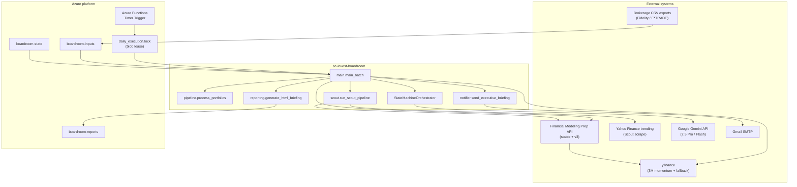
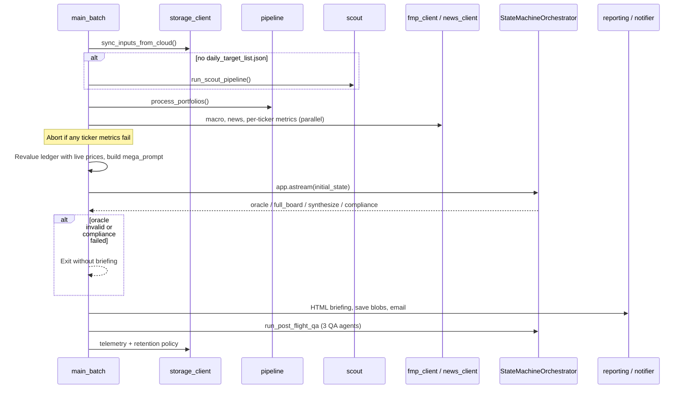
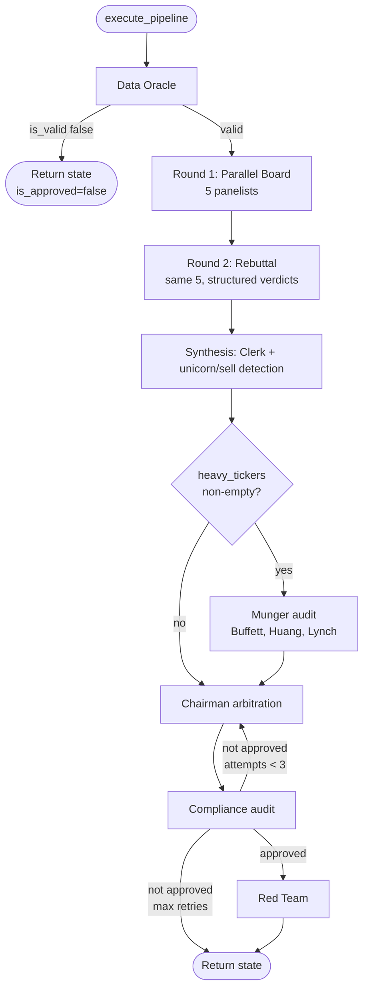
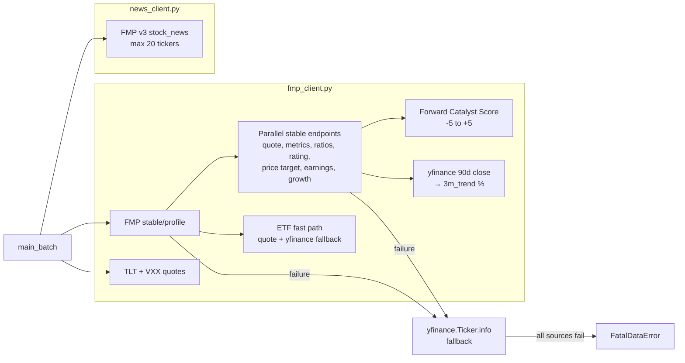

# SC Invest Boardroom — Technical Solution

**Document version:** 1.1  
**Last updated:** May 28, 2026  
**Repository:** `sc-invest-boardroom`

---

## 1. High-Level Architecture and System Context

### 1.1 Purpose

SC Invest Boardroom is an **automated, multi-agent investment advisory pipeline** for a concentrated, tech-heavy retail portfolio. It ingests brokerage CSV exports and market data, runs a structured “boardroom debate” among persona-driven LLM agents, synthesizes actionable trade recommendations under explicit risk rules, and delivers an **HTML executive briefing** by email—with supporting artifacts stored in Azure Blob Storage.

The system is designed for **Stan** (retail investor): outperform NASDAQ by ~5% annually, aggressive growth posture, Munger-style concentration, and institutional-style guardrails (wash-sale avoidance, max buys, liquidation caps, mandatory macro hedge).

### 1.2 System Context Diagram

### 1.3 Repository Layout

| Path | Role |
|------|------|
| `function_app.py` | Azure Functions entry: timer trigger, distributed lock, invokes `main_batch` |
| `host.json` | Functions host config (10-minute timeout, App Insights sampling) |
| `requirements.txt` | Python dependencies |
| `src/main.py` | End-to-end batch orchestration: data prep → debate → reports → email |
| `src/pipeline.py` | Native CSV parsing, master ledger, verdict history persistence |
| `src/scout.py` | Autonomous watchlist builder (Yahoo trending + FMP fallback) |
| `src/storage_client.py` | Azure Blob sync, report upload, 14-day retention |
| `src/core/engine.py` | State-machine debate pipeline (`StateMachineOrchestrator`, `AppWrapper`) |
| `src/core/agents.py` | Agent personas, Gemini client, async API wrapper with semaphore |
| `src/core/schemas.py` | Pydantic contracts for structured agent I/O and dynamic mandate |
| `src/config/settings.py` | Environment validation (FMP, Azure, email) |
| `src/data/fmp_client.py` | Async FMP + yfinance market metrics, macro quotes, FCS scoring |
| `src/data/news_client.py` | FMP v3 batched headline fetch for debate context |
| `src/data/*.json` | Sample/dev state (`daily_target_list.json`, `board_verdicts.json`) — runtime uses `/tmp/data` |
| `src/data/extracts/` | Local-only cache (not in repo) |
| `src/data/knowledge/` | Personal reference notes (not in repo) |
| `src/output/reporting.py` | Jinja2 HTML briefing + QuickChart visualizations |
| `src/output/notifier.py` | SMTP delivery of executive briefing |
| `logs/` | Local run logs (not part of runtime contract) |
| `docs/` | Technical documentation (this file) |

**Runtime filesystem conventions**

- Working data: `DATA_DIR` (default `/tmp/data` on Azure Linux; OS temp dir on Windows; override via `BOARDROOM_DATA_DIR`) — CSVs, `daily_target_list.json`, `board_verdicts.json`, `portfolio_history.json`
- Local report mirror: `OUTPUT_DIR` (default `/tmp/output`; override via `BOARDROOM_OUTPUT_DIR`)
- Cloud: three blob containers (`boardroom-inputs`, `boardroom-state`, `boardroom-reports`)

### 1.4 Deployment Model

- **Host:** Azure Functions (Python), timer `0 0 11 * * 1-5` (11:00 UTC, Monday–Friday).
- **Idempotency:** Blob lease on `boardroom-state/daily_execution.lock` prevents overlapping runs in the same window.
- **Secrets:** `GEMINI_API_KEY`, `FMP_API_KEY`, `AZURE_STORAGE_CONNECTION_STRING`, Gmail credentials (via `.env` / Function App settings).
- **Local execution:** `python -m src.main` (or equivalent) after placing inputs under `/tmp/data` or syncing from Azure.

### 1.5 Version Control and `src/data`

| Tracked in Git | Ignored (local reference only) |
|----------------|--------------------------------|
| `fmp_client.py`, `news_client.py` | `extracts/` |
| `board_verdicts.json`, `daily_target_list.json` | `knowledge/` |

Production runs still read/write runtime copies under `/tmp/data` and Azure `boardroom-state`; repo files serve as defaults and documentation of expected JSON shape.

---

## 2. Core Pipeline Flow and Agent Interactions

### 2.1 End-to-End Batch Flow (`main_batch`)

The batch runner is the **single orchestration spine**. It does not use LangGraph or a third-party workflow engine; debate logic lives in a custom `StateMachineOrchestrator` exposed through `AppWrapper.astream()` for incremental yields.

**Phase 0 — Input hydration**

1. Sync blobs from `boardroom-inputs` and state JSON from `boardroom-state` into `/tmp/data`.
2. If `daily_target_list.json` is missing, run **Scout** to populate watchlist (max 15 symbols).
3. **Pipeline** parses brokerage CSVs: merges positions across accounts (Taxable / Roth / 401K), attaches purchase dates from activity files, loads `board_verdicts.json` history.

**Phase 1 — Market enrichment** (`src/data/fmp_client.py`, `src/data/news_client.py`)

1. Open shared `aiohttp.ClientSession`.
2. `get_fmp_macro()` — parallel stable quotes for **TLT** and **VXX** (chairman hedge context); stored in `api_telemetry['MACRO_TLT_VXX']`.
3. `fetch_ticker_news()` — up to 20 tickers, 15 headlines via FMP v3 `stock_news`; injected as `=== LIVE MARKET HEADLINES ===` (red team weaponization).
4. `get_fmp_advanced_metrics()` for **QQQ** and **SPY**, then `asyncio.gather` for every portfolio + watchlist symbol.
5. **Hard fail:** Any `FatalDataError` or exception from metrics fetch aborts the batch (prevents LLM hallucination on empty quotes).
6. Revalue ledger using `current_price` from metrics; scale Taxable/Roth/401K buckets proportionally.
7. Refresh watchlist prices when FMP returns `current_price > 0`.
8. Append today’s portfolio vs SPY to `portfolio_history.json` and mirror to blob state.
9. Build `mega_prompt` and compute `heavy_tickers` / `live_mandate`.

**Phase 2 — Boardroom state machine** (see §2.2)

**Phase 3 — Delivery**

1. Parse board messages into a vote matrix markdown table.
2. `generate_html_briefing()` → save timestamped HTML, raw debate MD, QA summary to blob + `/tmp/output`.
3. Email HTML via Gmail SMTP.
4. Always flush `api_telemetry_*.json` and run 14-day blob retention (preserving lock + core state files).

### 2.2 Debate Pipeline (`StateMachineOrchestrator.execute_pipeline`)

All board agents share a common invocation path `_run_agent()`:

- **System prompt stack:** persona instruction + concentration exemption + schema binding + live mandate + Munger / retail edge / watchlist rules + tone override.
- **User content:** `base_data_prompt` + round-specific context.
- **Models:** `gemini-2.5-pro` (panel, chairman, red team, post-mortem) vs `gemini-2.5-flash` (oracle, clerk, compliance, architect).
- **Structured output:** Pydantic schemas enforced via Gemini `response_schema` where applicable.
- **Concurrency cap:** `asyncio.Semaphore(15)` on API calls; retries with exponential backoff (3 attempts).

| Step | Agents | Parallelism | Output |
|------|--------|-------------|--------|
| **Data Oracle** | Pre-Flight Data Oracle (Flash) | Sequential gate | `is_valid` — fails run only on **$0.00** current price |
| **Round 1** | Buffett, Lynch, Livermore, Huang, Simons | `asyncio.gather` | Narrative messages appended to `state.messages` |
| **Round 2** | Same five panelists | `asyncio.gather` | `raw_verdicts` + rebuttal messages; structured `PanelistPortfolioVerdict` |
| **Synthesis** | Clerk (Dalio persona, Flash) | Sequential | `chief_of_staff_json`; detects **unicorn trades** (all 5 panelists identical verdict) and **sell candidates** |
| **Munger audit** | Buffett, Huang, Lynch | `asyncio.gather` (optional) | Extra concentration review; results not merged into chairman state today |
| **Chairman loop** | Chairman (Druckenmiller, Pro) | Up to 3 iterations with Compliance | `chairman_draft_json` (`ChairmanMasterSynthesis`) |
| **Compliance** | Markopolos persona (Flash) | Per iteration | `is_approved`, `qa_feedback` for chairman retry |
| **Red Team** | Adversarial Red Teamer (Pro) | Only if approved | `bear_case_narrative` using live headlines |
| **Post-flight QA** | Post Mortem, Systems Architect, Prompt Engineer | Outside engine, in `main_batch` | Markdown QA report (non-blocking for email) |

**Chairman ↔ Compliance feedback loop**

The chairman must satisfy procedural rules encoded in prompts and validated by compliance:

- Democratic majority on executed buys (max 3).
- 10% portfolio liquidation cap for funding purchases (fractional trims allowed).
- Reallocation “deathmatch” when buying new names.
- Mandatory macro hedge (TLT/VXX-class assets exempt from “originator violation”).
- Wash-sale: no sell within 30 days of purchase date in context.
- Alpha pick must have majority board support.

If compliance fails, `qa_feedback` is injected into the next chairman prompt; after three attempts the pipeline ends without approval (no email briefing).

**Streaming interface (`AppWrapper.astream`)**

Yields keyed stages for observability:

1. `oracle` — validity + reason  
2. `full_board` — accumulated debate messages (if oracle passed)  
3. `synthesize` — clerk JSON + unicorn trades  
4. `compliance` — approval flag, chairman JSON, red team JSON  

`main_batch` consumes this stream to build the raw debate log and final artifacts.

### 2.3 Agent Roster

| Key | Persona | Model | Primary function |
|-----|---------|-------|------------------|
| `buffett` | Warren Buffett | Pro | Value, moat, margin of safety; anti-sycophancy PE caps |
| `lynch` | Peter Lynch | Pro | Growth categories, relative PEG vs peers |
| `livermore` | Jesse Livermore | Pro | Tape/momentum only; no fundamental justification |
| `huang` | Jensen Huang | Pro | Accelerated compute / full-stack moat lens |
| `simons` | Jim Simons | Pro | Quant/Kelly sizing; refuses trade on null data |
| `clerk` | Ray Dalio (Chief of Staff) | Flash | Debate synthesis, State of the Union quotes |
| `chairman` | Stanley Druckenmiller | Pro | Final allocations, capital math scratchpad |
| `data_oracle` | Pre-Flight Data Oracle | Flash | Kill switch on zero prices only |
| `compliance` | Harry Markopolos | Flash | Forensic audit of chairman vs board |
| `red_teamer` | Adversarial Red Teamer | Pro | Bear case from headlines (isolated from debate) |
| `post_mortem_qa` | Post Mortem QA Auditor | Pro | Post-run procedural audit |
| `system_architect` | Systems Architect QA | Flash | Pipeline/JSON technical audit |
| `prompt_engineer` | Prompt Engineer QA | Pro | Persona drift / sycophancy audit |

**Cross-cutting agent directives (`META_DIRECTIVE`)**

- Agents are **adversaries**, not collaborators; unanimous agreement is treated as failure mode.
- No naked ticker lists—each verdict requires rationale (feeds chairman narratives).
- Wash-sale awareness on purchase dates in the prompt.

### 2.4 Scout Sub-Pipeline

Runs when watchlist file is absent:

1. Load `ledger_state.json` and `board_verdicts.json` from `/tmp/data`.
2. Scrape Yahoo Finance trending tickers (or FMP technology screener fallback).
3. Exclude owned symbols and symbols in **cooldown** after recent `Pass` verdicts (7–14 days).
4. Write up to 15 entries to `daily_target_list.json` with placeholder price `1.0` (updated later by FMP in `main_batch`).

### 2.5 Data Contracts (Pydantic)

Key schemas in `src/core/schemas.py`:

- `PanelistPortfolioVerdict` — per-panelist portfolio + watchlist verdicts with conviction 1–10.
- `ChiefOfStaffSynthesis` — `boardroom_brawl` narrative + `state_of_the_union_quotes`.
- `ChairmanMasterSynthesis` — scratchpad, macro view, capital flow, positions, alpha pick, catalysts.
- `ComplianceReport` — `is_compliant`, violations, feedback loop text.
- `BoardroomState` — carrier for prompts, messages, approval flags, unicorn/sell candidate lists.

Structured JSON is **required** at critical boundaries; free-text is used for Round 1 narrative and QA agents.

### 2.6 Market Data Layer (`src/data`)

The data layer is a **resilient, multi-source enrichment stack** between CSV ingestion and the LLM boardroom. It is not a separate microservice; `main_batch` calls it directly.

#### `get_fmp_advanced_metrics(symbol, api_key, session, telemetry_ledger)`

| Concern | Implementation |
|---------|----------------|
| **Primary API** | FMP **stable** base (`https://financialmodelingprep.com/stable`) |
| **ETF detection** | `profile` → `isEtf` / `isFund`; simplified return path (no PE/growth; FCS = 0) |
| **Equity path** | Seven endpoints fetched in parallel via `asyncio.gather` |
| **3M trend** | Always from **yfinance** (`asyncio.to_thread` on 90-day download), not FMP |
| **Fallback** | If profile or quote/ratio chains fail → `yfinance.Ticker.info` |
| **Fatal exit** | `FatalDataError` when all sources exhausted or `current_price` is N/A/zero |
| **Retries** | `tenacity` on `fetch_json_endpoint`: 5 attempts, exponential backoff, handles 429 |
| **Telemetry** | Per-symbol, per-endpoint URL (redacted key) + response logged into `api_telemetry` |

**Returned metric dict** (consumed by `main_batch` prompt builder):

| Field | Source / notes |
|-------|----------------|
| `current_price` | FMP quote, else yfinance |
| `fwd_pe`, `peg`, `ps`, `de` | FMP ratios TTM, else yfinance |
| `3m_trend` | yfinance momentum % |
| `3y_cagr` | Placeholder `"N/A"` (reserved) |
| `rev_growth`, `eps_growth` | FMP financial-growth, else yfinance |
| `consensus`, `price_target` | FMP rating + price-target-consensus |
| `next_earnings` | Nearest future date from `earning_calendar` |
| `beta` | Profile or yfinance |
| `fcs_score`, `fcs_rationale` | Rule-based Forward Catalyst Score (see below) |

**Forward Catalyst Score (FCS)** — deterministic, not LLM-generated:

- +2 bullish consensus (rating contains “buy”); −2 if “sell”
- +2 implied upside > 15%; −3 if upside < 0%
- +1 earnings within 21 days
- Clamped to [−5, +5]; rationale string joins triggered rules

#### `get_fmp_macro(api_key, session)`

Returns `{"TLT": price, "VXX": price}` for macro hedge sizing context. Failures degrade to `"N/A"` without aborting the batch (unlike per-ticker metrics).

#### `fetch_ticker_news(tickers, api_key, session)`

- Endpoint: `https://financialmodelingprep.com/api/v3/stock_news`
- Caps at first **20** symbols, **15** articles
- Output: newline-separated `[SYMBOL]: title` lines
- Non-200 or errors → soft fallback strings (`"News feed unavailable."`, etc.) — debate continues

#### Sample / dev artifacts in `src/data/`

| File | Purpose |
|------|---------|
| `daily_target_list.json` | Rich watchlist example (symbol, name, reason, price, trends, CAGR) — production watchlist is written to `/tmp/data` by Scout or synced from blob |
| `board_verdicts.json` | Empty `{}` placeholder; runtime history lives in `/tmp/data` and `boardroom-state` |

### 2.7 Outputs and Observability

| Artifact | Description |
|----------|-------------|
| `executive_briefing_{timestamp}.html` | Primary deliverable: charts, mandate, chairman actions, red team, matrix |
| `raw_debate_log_{timestamp}.md` | Full prompt context + round-by-round debate |
| `qa_summary_{timestamp}.md` | Post-flight tri-agent QA |
| `api_telemetry_{timestamp}.json` | Cached FMP/macro/news payloads for debugging |
| `portfolio_history.json` | Daily portfolio vs SPY (and QQQ in charts when present) |

Email subject: `SC Invest: Executive Boardroom Briefing - {date}`.

---

## 3. Technical Stack and Design Assessment

### 3.1 Stack Summary

| Layer | Technology |
|-------|------------|
| Runtime | Python 3.x, asyncio |
| Compute | Azure Functions v4 (timer trigger) |
| LLM | Google GenAI SDK (`google-genai`), Gemini 2.5 Pro & Flash |
| Validation | Pydantic v2 models + Gemini JSON schema mode |
| Market data | FMP stable + v3 (`fmp_client`, `news_client`); **yfinance** for 3M trend and quote fallback |
| HTTP | `aiohttp` for concurrent FMP fetches; `tenacity` retries on rate limits |
| Scraping | `requests` + BeautifulSoup (Scout / Yahoo) |
| Storage | Azure Blob Storage (inputs, state, reports) |
| Reporting | Jinja2 HTML templates, QuickChart.io chart URLs |
| Notifications | Gmail SMTP (`smtplib`) |
| Config | `python-dotenv`, `Settings.validate()` |

**Notable dependencies in `requirements.txt`:** `yfinance` and `tenacity` are on the **hot path** (`fmp_client` momentum + retries). `pandas` is a transitive dependency of yfinance; `pipeline.py` uses native CSV parsing, not pandas.

### 3.2 Design Strengths

1. **Defense in depth against bad outputs**
   - Data Oracle ($0 price gate) before expensive debate.
   - FMP batch abort on any ticker failure.
   - Compliance loop with explicit chairman feedback.
   - Red team isolated from panel echo chamber.
   - Post-flight QA trio for procedural, systems, and prompt drift review.

2. **Clear separation of concerns**
   - `pipeline.py` = deterministic ingestion.
   - `engine.py` = debate state machine.
   - `agents.py` = persona + API transport.
   - `schemas.py` = contracts and mandate math.
   - `main.py` = composition root.

3. **Operational hygiene**
   - Distributed lock for scheduled runs.
   - Blob retention policy with protected state files.
   - API telemetry dump on every run (success or failure).
   - Semaphore-limited Gemini concurrency.

4. **Domain-aware product design**
   - Personas encode real incompatible investment philosophies (value vs tape vs quant).
   - Chairman encodes portfolio-level constraints retail advisors rarely automate (hedge mandate, buy cap, deathmatch funding).
   - Dynamic retirement mandate ties LLM context to portfolio math.

5. **Structured synthesis for UI**
   - Chairman and clerk outputs map cleanly to HTML briefing sections (narratives, quotes, avatars from Azure CDN).

6. **Resilient market data client**
   - Layered FMP → yfinance fallback with explicit `FatalDataError` boundary before LLM calls.
   - Per-endpoint telemetry aids post-mortem debugging of bad tickers or API limits.
   - Deterministic FCS gives agents a shared, auditable catalyst signal alongside raw fundamentals.

### 3.3 Risks, Gaps, and Improvement Opportunities

| Area | Observation | Suggested direction |
|------|-------------|---------------------|
| **FMP API surface split** | Metrics use **stable** URLs; news uses legacy **v3** path — different rate-limit behavior. | Monitor 429s in telemetry; consider stable news endpoint if FMP offers one. |
| **`3y_cagr` not populated** | `get_fmp_advanced_metrics` always returns `"N/A"` for 3Y CAGR though sample `daily_target_list.json` includes CAGR from another pipeline. | Wire FMP historical growth or drop unused field from prompts. |
| **`GEMINI_API_KEY` not in `Settings.validate()`** | Runtime fails inside agents if unset, but validation message is incomplete. | Add to `validate()` alongside FMP/Azure/email. |
| **Munger audit results discarded** | `execute_munger_audit` runs panelists but does not update `state.munger_overrides` or chairman input. | Persist audit JSON and inject into chairman prompt when concentration triggers. |
| **Placeholder / static data in pipeline** | `sector_weights` and `dummy_qqq_trend` in `process_portfolios()` appear unused or stale vs live FMP trend in `main_batch`. | Remove dead fields or wire real sector breakdown from FMP. |
| **Hard-coded `/tmp` paths** | Fine for Azure Functions Linux; awkward for local Windows dev. | Configurable `DATA_DIR` / `OUTPUT_DIR` env vars. |
| **Scout price placeholder `1.0`** | Oracle would fail if scout ran without subsequent FMP refresh; `main_batch` fixes prices when FMP succeeds. | Fail fast in scout or require FMP before oracle. |
| **No workflow framework** | Custom state machine is readable but lacks checkpoint/resume, visual debugging, or per-step metrics. | Acceptable at current scale; consider LangGraph or durable functions if steps multiply. |
| **Chairman loop cost** | Up to 3× (chairman + compliance) full Pro/Flash calls on rejection. | Cache board verdicts; tighten compliance schema to reduce rework. |
| **Email as sole alert channel** | No Slack/webhook on oracle abort or compliance failure. | Optional failure notification path. |
| **10-minute function timeout** | Large portfolios × many FMP calls × multi-round Gemini may approach limit on bad network days. | Monitor telemetry duration; shard FMP or reduce watchlist size. |

### 3.4 Architectural Stance (Summary)

The codebase implements a **batch-oriented, gate-heavy multi-agent system** rather than a conversational copilot. Design choices favor **deterministic pre-processing**, **schema-bound LLM outputs**, and **explicit procedural law** (chairman + compliance) over open-ended agent autonomy—appropriate for regulated-adjacent personal investment automation where explainability and constraint adherence matter.

The metaphor layer (Buffett, Livermore, etc.) is not decorative: prompts encode conflicting epistemic rules (fundamentals vs tape vs quant), and `META_DIRECTIVE` actively punishes consensus—this is the core product differentiator relative to a single “financial advisor” prompt.

---

## Appendix A — Environment Variables

| Variable | Used by |
|----------|---------|
| `GEMINI_API_KEY` | `src/core/agents.py` (now validated in `Settings.validate()`) |
| `FMP_API_KEY` | Scout fallback, `main_batch` market data |
| `BOARDROOM_DATA_DIR` *(optional)* | Overrides working data directory (`DATA_DIR`) |
| `BOARDROOM_OUTPUT_DIR` *(optional)* | Overrides report output directory (`OUTPUT_DIR`) |
| `AZURE_STORAGE_CONNECTION_STRING` | `storage_client`, `function_app` lock |
| `SENDER_EMAIL` / `SENDER_PASSWORD` | `notifier` |
| `STAN_PERSONAL_EMAIL` | Briefing recipient |

## Appendix B — Azure Blob Containers

| Container | Typical contents |
|-----------|------------------|
| `boardroom-inputs` | Brokerage CSV exports |
| `boardroom-state` | `board_verdicts.json`, `portfolio_history.json`, `daily_target_list.json`, locks, telemetry JSON |
| `boardroom-reports` | HTML briefings, debate logs, QA summaries |

## Appendix C — Key File References

- Orchestrator entry: `src/core/engine.py` — `StateMachineOrchestrator`, `AppWrapper`
- Agent registry: `src/core/agents.py` — `agent_config`, `call_gemini_async`
- Batch entry: `src/main.py` — `main_batch`, `run_post_flight_qa`
- Scheduled entry: `function_app.py` — `boardroom_daily_run`
- CSV ingestion: `src/pipeline.py` — `process_portfolios`, `parse_broker_csv`
- Market data: `src/data/fmp_client.py` — `get_fmp_advanced_metrics`, `get_fmp_macro`, `fetch_momentum_trend`
- News: `src/data/news_client.py` — `fetch_ticker_news`

## Appendix D — FMP Endpoints Used (`fmp_client`)

| Function | Endpoint pattern |
|----------|------------------|
| Profile / ETF flag | `GET /stable/profile?symbol=` |
| Quote | `GET /stable/quote?symbol=` |
| Key metrics TTM | `GET /stable/key-metrics-ttm?symbol=` |
| Ratios TTM | `GET /stable/ratios-ttm?symbol=` |
| Analyst rating | `GET /stable/rating?symbol=` |
| Price target consensus | `GET /stable/price-target-consensus?symbol=` |
| Earnings calendar | `GET /stable/earning_calendar?symbol=` |
| Financial growth | `GET /stable/financial-growth?symbol=` |
| Macro hedge | `GET /stable/quote?symbol=TLT` and `VXX` |
| News (`news_client`) | `GET /api/v3/stock_news?tickers=&limit=15` |
